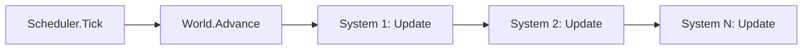

# ENGINE-003 — Scheduler et boucle de simulation

> Version : 1.0
> Statut : Stable
> Maturité : 3
> Bibliothèque : ENGINE

⸻

# 1. Objectif

Documenter rétroactivement le mécanisme qui fait avancer un `World` d'un
Tick et invoque les Systems enregistrés --- implémenté depuis la v0.2 du
moteur, avant la création de la bibliothèque ENGINE (MASTER-007,
Maturité 3).

---

# 2. Principe

Un `Scheduler` maintient une liste ordonnée de Systems (`ISystem`). Faire
avancer la simulation d'un pas consiste à :

1. faire avancer le `Tick` courant du World ;
2. invoquer `Update` sur chaque System enregistré, toujours dans le même
   ordre --- celui de leur enregistrement.

Cet ordre fixe est la condition du déterminisme exigé par le Principe 10
de MASTER-002 : à état identique, la même séquence de Systems produit
toujours le même résultat.

---

# 3. Responsabilités

Le Scheduler est responsable de :

- faire avancer le `World` d'exactement un Tick par appel à `Tick(world)` ;
- invoquer chaque System enregistré, dans l'ordre de leur enregistrement,
  sans exception ni saut.

Il n'est jamais responsable :

- de la logique propre à un System (chaque System reste seul responsable
  de ce qu'il fait de `Update`) ;
- de décider quels Systems existent --- ils sont enregistrés
  explicitement par l'appelant via `Register`, jamais découverts
  automatiquement.

---

# 4. Architecture

## ISystem (`Systems/ISystem.cs`)

Interface à une seule méthode : `void Update(World world, Tick
currentTick)`. Tout System implémente cette interface. Un System applique
une logique aux Entity d'un World à chaque Tick --- décider, exécuter une
logique ou déclencher un Event sont des responsabilités interdites à un
Component (CORE-003-C) mais explicitement permises, voire attendues, d'un
System.

## Scheduler (`Systems/Scheduler.cs`)

Classe portant une `List<ISystem>` interne, exposée en lecture seule via
`Systems`. `Register(system)` ajoute un System en fin de liste ---
l'ordre d'enregistrement devient l'ordre d'exécution, définitivement.
`Tick(world)` fait avancer le World (`world.Advance()`) puis invoque
`Update` sur chaque System enregistré, dans l'ordre.

---

# 5. Flux

Chaque System reçoit le même `World` et le même `CurrentTick`,
fraîchement avancé. Un System peut publier des Events (ENGINE-001),
modifier des Components, ou faire progresser un Lifecycle --- le
Scheduler ne connaît rien de ce que fait chaque System, il se contente
de les invoquer dans l'ordre.

---

# 6. Contrat

Le Scheduler garantit les invariants suivants.

## Ordre stable

L'ordre d'invocation des Systems est toujours celui de leur
enregistrement --- jamais réordonné, jamais parallélisé.

## Un seul avancement par Tick

Un appel à `Scheduler.Tick(world)` fait avancer le World d'exactement un
Tick, jamais plus, jamais moins.

## Invocation totale

Tous les Systems enregistrés sont invoqués à chaque appel de `Tick` ---
aucun n'est sauté, quel que soit ce qu'un System précédent a fait pendant
son propre `Update`.

---

# 7. Invariants

- `Scheduler.Systems` ne contient jamais deux fois la même instance de
  System avec un ordre différent d'un appel à l'autre.
- `World.CurrentTick` après `Scheduler.Tick` est toujours strictement
  supérieur à sa valeur avant l'appel.
- Aucun System ne peut modifier l'ordre d'exécution des autres Systems
  pendant son propre `Update`.

---

# 8. Validation

Le Scheduler est considéré conforme si :

✓ l'ordre d'exécution des Systems reste identique à chaque Tick, pour un
même `Scheduler` ;

✓ `Scheduler.Tick(world)` avance `World.CurrentTick` d'exactement un rang ;

✓ tous les Systems enregistrés sont invoqués.

Les trois points sont vérifiés par `SchedulerTests` (3 tests) :
avancement du Tick, invocation effective d'un System enregistré (via
`NeedsDecaySystem`), et ordre d'exécution strict de plusieurs Systems
(via un System de test dédié, `OrdreTraceur`).

---

# 9. Historique

## Version 1.0

- Documentation rétroactive du Scheduler (méthodologie MASTER-008
  étendue --- voir MASTER-008 v1.2). Implémenté depuis la v0.2 du
  moteur, avant la création de la bibliothèque ENGINE. `SchedulerTests`
  (3 tests) couvre déjà les trois invariants de ce document.
