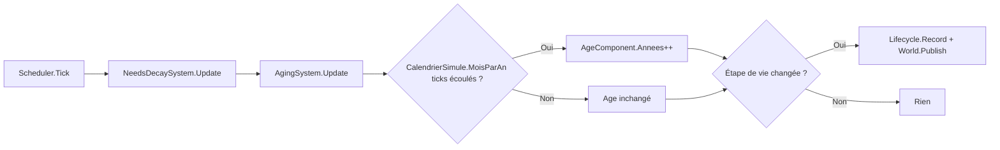

# ENGINE-004 — Systems de simulation

> Version : 1.0
> Statut : Stable
> Maturité : 3
> Bibliothèque : ENGINE

⸻

# 1. Objectif

Documenter rétroactivement les Systems concrets déjà implémentés dans le
moteur --- `NeedsDecaySystem`, `AgingSystem`, et l'utilitaire
`CalendrierSimule` sur lequel `AgingSystem` s'appuie --- implémentés
depuis la v0.2 du moteur, avant la création de la bibliothèque ENGINE
(MASTER-007, Maturité 3).

Ce document ne couvre pas l'interface `ISystem` elle-même ni le
`Scheduler` qui les invoque : voir ENGINE-003.

---

# 2. Principe

Toute la logique de jeu vit dans les Systems, jamais dans les Components
qu'ils font évoluer (CORE-003-C). Un Component reste une pure donnée ;
c'est le System correspondant qui décide comment elle change à chaque
Tick.

Les paramètres numériques (taux de déclin, seuils d'âge) sont des
paramètres de constructeur plutôt que des constantes internes ---
premier pas vers le principe data-driven de PROD/FeuilleDeRoute.md, sans
construire prématurément un pipeline de contenu externe complet
qu'aucun autre System ne justifie encore (MASTER-006).

---

# 3. Responsabilités

## NeedsDecaySystem (`Systems/NeedsDecaySystem.cs`)

Fait évoluer `NeedsComponent` (Faim, Fatigue, Santé, Moral --- chacune de
0 à 100) à chaque Tick, conformément à GDB-004B.

Responsable de :

- décrémenter Faim et Fatigue d'un taux fixe par Tick ;
- décrémenter Moral lorsque Faim ou Fatigue franchit un seuil de
  détresse (les besoins s'influencent mutuellement, GDB-004B) ;
- borner chaque valeur entre 0 et 100.

N'est jamais responsable de faire varier Santé : seules la maladie ou la
blessure la font varier (GDB-022), non implémentées --- pas
d'anticipation sans motif réel (MASTER-006).

## AgingSystem (`Systems/AgingSystem.cs`)

Fait progresser `AgeComponent` et le `Lifecycle` de chaque Entity à
chaque Tick, conformément à GDB-008C : enfance → adolescence → âge
adulte → maturité → vieillesse → mort.

Responsable de :

- incrémenter `AgeComponent.Annees` d'une année tous les
  `CalendrierSimule.MoisParAn` Ticks (jamais à chaque Tick) ;
- déterminer l'étape de vie correspondant à l'âge courant ;
- faire progresser le `Lifecycle` de l'Entity quand l'étape change,
  via `Lifecycle.Record` (le Lifecycle reste strictement descriptif,
  CORE-010-C --- c'est AgingSystem qui décide) ;
- publier un `GameEvent` (`vie.etape.{etape}` ou `vie.mort`) à chaque
  changement d'étape ;
- ne plus rien faire pour une Entity déjà à l'état `"mort"` --- ni
  incrémenter son âge, ni republier d'événement.

## CalendrierSimule (`Systems/CalendrierSimule.cs`)

Traduit un Tick en repères de calendrier (saison, année). Source unique
de vérité pour cette conversion --- `AgingSystem` s'appuie dessus plutôt
que de dupliquer ses constantes. Voir le code pour le détail (`SaisonAu`,
`AnneeAu`, `MoisParAn`).

---

# 4. Architecture

## Constructeurs paramétrés

| System | Paramètres (valeurs par défaut) |
|---|---|
| `NeedsDecaySystem` | `faimDeclinParTick` (1.0), `fatigueDeclinParTick` (0.75), `moralDeclinEnDetresse` (0.5), `seuilDetresse` (20.0) |
| `AgingSystem` | `seuilAdolescence` (12), `seuilAgeAdulte` (18), `seuilMaturite` (40), `seuilVieillesse` (65), `esperanceDeVie` (80) |

Les valeurs par défaut d'`AgingSystem` sont des hypothèses de travail
provisoires (voir la documentation XML du code) --- GDB-008C nomme les
étapes de vie sans fixer les âges de bascule ; aucun document ne fixe
d'espérance de vie. Une ADR devra confirmer ou corriger ces valeurs
avant la v0.3, conformément à ce que le code lui-même documente déjà.

## Composants lus/modifiés

`NeedsDecaySystem` lit et modifie exclusivement `NeedsComponent`.
`AgingSystem` lit et modifie `AgeComponent` et le `Lifecycle` de
l'Entity ; il ne touche jamais à `NeedsComponent`.

Une Entity sans le Component attendu (`TryGet` renvoie `false`) est
silencieusement ignorée par le System correspondant --- jamais une
erreur.

---

# 5. Flux

L'ordre `NeedsDecaySystem` puis `AgingSystem` correspond à leur ordre
d'enregistrement dans le Scheduler --- fixé par l'appelant, pas par ce
document (voir ENGINE-003).

---

# 6. Contrat

## NeedsDecaySystem

- Faim et Fatigue ne descendent jamais sous 0 ni ne dépassent 100.
- Moral ne décline que si Faim ou Fatigue est en détresse (≤ seuil) ---
  jamais en dehors de cette condition.
- Santé n'est jamais modifiée par ce System.

## AgingSystem

- L'âge n'incrémente que tous les `CalendrierSimule.MoisParAn` Ticks,
  jamais à chaque Tick.
- Une Entity à l'état `"mort"` ne vieillit plus et ne republie jamais
  d'événement.
- Chaque changement d'étape produit exactement un `GameEvent`, jamais
  zéro, jamais plusieurs.
- L'état `Lifecycle` et l'événement publié sont toujours cohérents
  entre eux (le `Kind` de l'événement correspond exactement à l'étape
  enregistrée).

---

# 7. Invariants

- Un Component absent n'est jamais une erreur pour le System qui le
  cherche --- l'Entity est ignorée, silencieusement.
- `AgingSystem` ne modifie jamais `CalendrierSimule` ; il ne fait que le
  consulter (`MoisParAn`).
- Aucun des deux Systems ne publie d'événement sans qu'un changement
  d'état réel se soit produit.

---

# 8. Validation

Ces Systems sont considérés conformes si les tests existants passent :

✓ `AgingSystemTests` --- vieillissement au bon rythme, transitions
d'étape, mort, absence de republication, Entity sans AgeComponent ;

✓ `CalendrierSimuleTests` --- bornes exactes de chaque saison et année ;

✓ `NeedsDecaySystemTests` (6 tests) --- déclin de Faim/Fatigue,
bornage à 0, déclin du Moral en détresse, absence de déclin du Moral
hors détresse, Santé jamais affectée par le simple écoulement du temps,
Entity sans NeedsComponent ignorée sans erreur.

---

# 9. Historique

## Version 1.0

- Documentation rétroactive de `NeedsDecaySystem`, `AgingSystem` et
  `CalendrierSimule` (méthodologie MASTER-008 étendue --- voir
  MASTER-008 v1.2). Implémentés depuis la v0.2 du moteur, avant la
  création de la bibliothèque ENGINE.
