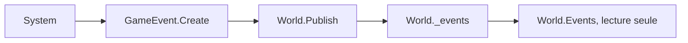

# ENGINE-001 — Journal d'événements du World

> Version : 2.1
> Statut : Stable
> Maturité : 3
> Bibliothèque : ENGINE

⸻

# 1. Objectif

Définir le mécanisme par lequel le moteur Chroniques enregistre les faits
significatifs survenus dans la simulation, sous forme d'événements
immuables (GameEvent, implémentant la primitive Event de CORE-007).

Ce document décrit le mécanisme réellement implémenté dans
`CHRONIQUES-ENGINE` --- pas une architecture Subscribe/Handler envisagée
puis jamais construite (voir section 9, Historique, pour cette révision).

---

# 2. Principe

Chaque `World` maintient un journal d'événements : une liste ordonnée,
dans laquelle tout System peut ajouter un `GameEvent` à tout moment via
`World.Publish(...)`.

Il n'existe aucun mécanisme d'abonnement. Aucun System ne « reçoit » un
événement au moment où il est publié --- un événement est simplement
ajouté au journal, lisible par quiconque a accès au World (tests,
outils d'inspection, TECH, un futur Rendering).

Un System qui doit réagir à un fait précédent ne le fait jamais en
observant `World.Events` --- il le fait en observant l'état du monde
lui-même (un Component, un Lifecycle) au Tick suivant. Le journal
d'événements sert à l'observabilité, pas à la communication entre
Systems.

---

# 3. Responsabilités

Le journal d'événements est responsable de :

- accepter tout `GameEvent` publié, sans condition ni validation de
  contenu ;
- préserver l'ordre de publication ;
- rester lisible en lecture seule depuis l'extérieur du World.

Il n'est jamais responsable :

- de distribuer un événement à un destinataire précis ;
- de déclencher une réaction chez un System ;
- de filtrer, transformer ou supprimer un événement publié.

---

# 4. Composants

## GameEvent

Un `GameEvent` (`Kernel/GameEvent.cs`) représente un fait survenu dans le
moteur. Implémenté comme `record` --- immuable par construction, aucune
mutation possible après création (CORE-000-G : « les Events sont
immuables »).

Champs : `Id` (Guid), `OccurredAt` (Tick), `Kind` (string), `Source`
(EntityId?), `Target` (EntityId?).

Nommé `GameEvent` plutôt que `Event` pour éviter toute confusion avec le
mot-clé C# `event` --- le mapping conceptuel avec CORE-007 reste
explicite dans la documentation XML du code.

Exemples de `Kind` déjà en usage : `vie.etape.enfance`,
`vie.etape.adolescence`, `vie.etape.age_adulte`, `vie.etape.maturite`,
`vie.etape.vieillesse`, `vie.mort` (voir `Systems/AgingSystem.cs`).

## World (journal)

Le `World` (`Kernel/World.cs`) maintient la liste `_events`, exposée en
lecture seule via `Events` (`IReadOnlyList<GameEvent>`).

`Publish(GameEvent)` ajoute l'événement en fin de liste. `ReplayEvents`
(interne, réservé à `Persistence.WorldRepository`) réinjecte une liste
d'événements lors d'un rechargement, sans passer par `Publish`.

---

# 5. Cycle de vie

Il n'existe pas de distribution : le cycle s'arrête à l'ajout dans la
liste. Ce qui consulte `World.Events` ensuite (un test, TECH, un futur
outil d'inspection) le fait activement, à son propre rythme --- jamais
par notification.

---

# 6. Flux

1. Un System détecte un fait significatif pendant `Update`.
2. Il construit un `GameEvent` via `GameEvent.Create(tick, kind, source,
   target)`.
3. Il appelle `world.Publish(event)`.
4. L'événement est ajouté à `world.Events`, dans l'ordre.
5. Le cycle est terminé --- aucune notification n'est déclenchée.

---

# 7. Contrat

Le journal d'événements garantit les invariants suivants.

## Publication

Tout `GameEvent` peut être publié, sans condition.

## Ordre

`World.Events` reflète toujours l'ordre exact de publication.

## Immutabilité

Un `GameEvent` déjà publié ne peut jamais être modifié ni retiré du
journal (hors rechargement complet du World).

## Absence de distribution

Publier un événement ne déclenche jamais l'exécution d'un autre System.
Aucun System n'est notifié.

---

# 8. Contraintes

Le journal d'événements doit rester :

- déterministe (l'ordre de publication ne dépend que de l'ordre
  d'exécution des Systems, lui-même déterministe --- voir
  ENGINE-003, Scheduler) ;
- indépendant du gameplay ;
- indépendant de la persistance --- `WorldRepository` le lit et le
  réinjecte, il ne le gère pas.

---

# 9. Historique

## Version 2.1

- Constat trouvé en vérifiant le moteur suite à la création d'ENGINE-002
  à 005 : un dossier `Kernel/EventBus/` existait dans le code
  (`EventBus.cs`, `IEventBus.cs`, `IEventHandler.cs`, `IEvent.cs`,
  `TickAdvancedEvent.cs`), correspondant exactement à l'architecture
  Subscribe/Handler décrite par la version 1.0 de ce document. Chaque
  méthode y levait `NotImplementedException` --- un squelette jamais
  terminé --- et aucun autre fichier du moteur n'y faisait référence
  (`World`, `Scheduler`, `AgingSystem`, aucun test). Ce code contredisait
  la version 2.0 de ce document, qui décrit le mécanisme réellement
  fonctionnel (`World.Publish`/`Events`) comme le mécanisme officiel.
  Décision du porteur de projet : supprimer ce dossier plutôt que le
  laisser contredire silencieusement la spécification --- aucun projet
  SDK-style ne référence les fichiers individuellement (glob
  automatique), la suppression n'affecte aucune compilation.

## Version 2.0

- Révision complète suite à une divergence constatée avec le code
  réellement implémenté. La version 1.0 décrivait une architecture
  Subscribe/Handler (abonnement par type d'événement, distribution
  individuelle aux handlers) qui n'a jamais été construite --- le code
  existant (`World.Publish` / `World.Events`, utilisé par
  `AgingSystem` depuis la v0.2 du moteur) est une simple liste
  accumulée, sans abonnement ni distribution. Ce document décrit
  désormais ce mécanisme réel plutôt que l'architecture envisagée.
  Décision : conserver le mécanisme simple plutôt que construire le
  Subscribe/Handler de la v1.0, la v0.2 n'en ayant jamais eu besoin
  (MASTER-006 : pas d'anticipation sans motif réel). Si un besoin réel
  de distribution par type apparaît (ex. : un System qui doit réagir à
  un événement d'un autre System dans le même Tick), il sera documenté
  comme une évolution explicite de ce document, pas ajouté
  silencieusement au code.
- Passage de Maturité 2 (Spécification, avant tout code) à Maturité 3
  (Implémentation : le document correspond au code existant,
  identifiant pour identifiant --- MASTER-007).
- Renommage du titre : « EventBus » suggérait un mécanisme de
  distribution qui n'existe pas ; « Journal d'événements du World »
  décrit fidèlement ce qui est implémenté.

## Version 1.0

- Première spécification du système EventBus (Subscribe/Handler).
- Définition des responsabilités, invariants, cycle de vie et critères
  de validation --- jamais implémentés tels quels (voir version 2.0).
