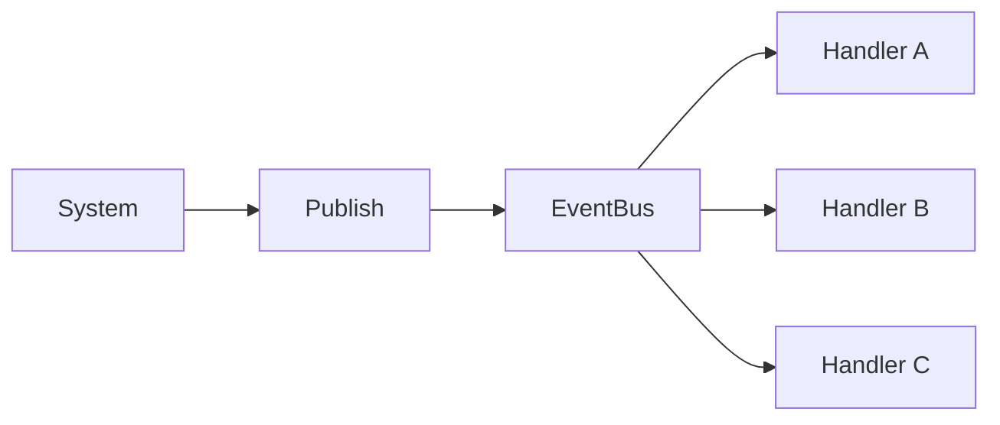

# ENGINE-001 — EventBus

> Version : 1.0
> Statut : Proposition
> Famille : ENGINE

⸻

## 1. Objectif

Définir le mécanisme de communication interne entre les systèmes du moteur Chroniques.

L'EventBus permet à un système de publier un événement sans connaître les systèmes qui le consommeront.

Cette architecture découple les composants du moteur et facilite son extensibilité.

---

## 2. Principe

Un système publie un événement.

Le bus identifie les abonnés à ce type d'événement.

Chaque abonné reçoit l'événement.

Le système émetteur ne connaît jamais les destinataires.

---

## 3. Composants

### Event

Un Event représente un fait survenu dans le moteur.

Il est immuable.

Il ne contient aucun comportement.

Exemples :

- TickAdvancedEvent
- NeedChangedEvent
- EntityCreatedEvent
- ActionCompletedEvent

---

### EventHandler

Un EventHandler est responsable du traitement d'un type précis d'événement.

Un même handler peut recevoir plusieurs événements successifs.

Un handler ne publie pas obligatoirement un nouvel événement.

---

### EventBus

Le EventBus est responsable :

- des abonnements ;
- des désabonnements ;
- de la publication des événements ;
- de la distribution aux handlers concernés.

Il ne contient aucune logique métier.

---

## 4. Cycle de vie

Le cycle d'un événement est le suivant :

---

## 5. Contrat

Le moteur garantit les invariants suivants :

- un événement peut être publié même sans abonnés ;
- chaque handler abonné reçoit exactement une fois l'événement ;
- un handler désabonné ne reçoit plus les événements ;
- seuls les handlers abonnés au bon type sont appelés.

Toute violation constitue une erreur du moteur.

---

## 6. Validation

L'EventBus est considéré valide si :

1. Publish fonctionne sans exception.

2. Subscribe enregistre correctement un handler.

3. Unsubscribe retire correctement un handler.

4. Plusieurs handlers reçoivent le même événement.

5. Aucun handler d'un autre type n'est invoqué.

---

## 7. Tests

Les tests unitaires minimum sont :

- Publish_Should_Call_Handler

- Publish_Should_Call_All_Handlers

- Publish_Should_Not_Call_Unsubscribed_Handler

- Publish_Should_Ignore_Other_Event_Types

- Publish_With_No_Handler_Should_Not_Throw

---

## Historique

### Version 1.0

- Première version.
