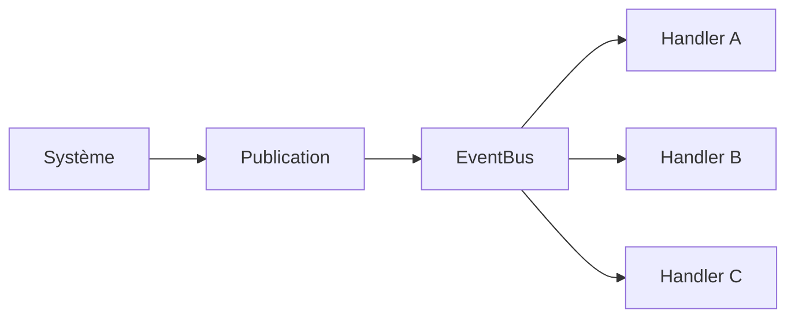

# ENGINE-001 — EventBus

> Version : 1.0
> Statut : Proposition
> Famille : ENGINE

⸻

# 1. Objectif

Définir le système de communication interne du moteur Chroniques.

L'EventBus permet aux composants du moteur d'échanger des informations sous forme d'événements sans créer de dépendances directes entre eux.

Il constitue l'un des mécanismes fondamentaux de l'infrastructure du moteur.

---

# 2. Principe

Le moteur repose sur une architecture orientée événements.

Lorsqu'un système produit un fait significatif, il publie un événement sur l'EventBus.

Tous les systèmes abonnés à ce type d'événement sont automatiquement notifiés.

Le système émetteur ne connaît jamais les destinataires.

Cette séparation garantit un faible couplage entre les composants du moteur.

---

# 3. Responsabilités

L'EventBus est responsable de :

- enregistrer les abonnements ;
- supprimer les abonnements ;
- publier les événements ;
- distribuer chaque événement aux handlers concernés.

Il n'est jamais responsable :

- de la logique métier ;
- de modifier directement le monde ;
- d'exécuter les Actions ;
- de prendre des décisions.

Il agit uniquement comme intermédiaire de communication.

---

# 4. Composants

## Event

Un Event représente un fait survenu dans le moteur.

Un événement est :

- immuable ;
- autonome ;
- sans comportement.

Il transporte uniquement les informations nécessaires à sa compréhension.

Exemples :

- TickAdvancedEvent
- NeedChangedEvent
- EntityCreatedEvent
- ActionCompletedEvent
- CalendarDayChangedEvent

---

## EventHandler

Un EventHandler traite un type précis d'événement.

Il peut :

- mettre à jour un composant ;
- publier un nouvel événement ;
- déclencher une action interne.

Un handler ne connaît jamais l'origine de l'événement.

---

## EventBus

Le EventBus est le point central de distribution des événements.

Il maintient la liste des handlers abonnés.

Lorsqu'un événement est publié, il le distribue à tous les handlers compatibles.

---

# 5. Cycle de vie

Le cycle complet d'un événement est le suivant.

Le système producteur ne dépend jamais des handlers.

Les handlers ne connaissent jamais le producteur.

---

# 6. Flux

1. Un système détecte un fait significatif.

2. Il crée un Event.

3. L'Event est publié sur le EventBus.

4. Le EventBus identifie les handlers abonnés.

5. Chaque handler reçoit exactement une notification.

6. Les handlers exécutent leur propre traitement.

7. Le cycle est terminé.

---

# 7. Contrat

Le EventBus garantit les invariants suivants.

## Publication

Tout événement peut être publié.

La publication ne dépend pas de la présence d'abonnés.

---

## Distribution

Chaque handler compatible reçoit exactement une notification.

Un handler incompatible n'est jamais invoqué.

---

## Abonnement

Un handler peut s'abonner à un type précis d'événement.

L'abonnement prend effet immédiatement.

---

## Désabonnement

Un handler désabonné ne reçoit plus aucun événement de ce type.

---

## Isolation

Les handlers sont indépendants.

Le traitement d'un handler ne doit pas empêcher les autres handlers de recevoir leur notification.

---

# 8. Invariants

Le moteur garantit que :

- un Event possède toujours un type unique ;
- un EventBus existe au plus une fois par World ;
- un handler appartient à zéro ou plusieurs types d'événements ;
- un événement est distribué uniquement aux handlers de son type ;
- la publication d'un événement sans handler n'est jamais une erreur.

Toute violation constitue une erreur du moteur.

---

# 9. Contraintes

Le EventBus doit rester :

- déterministe ;
- indépendant du gameplay ;
- indépendant du Scheduler ;
- indépendant de l'IA ;
- indépendant de la persistance.

Il constitue une infrastructure du moteur.

---

# 10. Performances

Le coût d'une publication dépend uniquement du nombre de handlers abonnés au type publié.

La recherche d'un type d'événement doit rester en temps constant.

L'EventBus ne conserve jamais l'historique des événements.

---

# 11. Cas particuliers

## Aucun handler

La publication est ignorée.

Aucune exception n'est levée.

---

## Plusieurs handlers

Tous les handlers sont exécutés.

L'ordre d'exécution n'est pas garanti par cette spécification.

---

## Publication récursive

Un handler peut publier un nouvel événement.

Le moteur reste responsable de préserver sa stabilité.

La stratégie exacte d'exécution est laissée à l'implémentation.

---

# 12. Validation

Le composant est considéré valide si les comportements suivants sont observés.

## Publish

Un événement peut être publié sans erreur.

---

## Subscribe

Un handler reçoit les événements auxquels il est abonné.

---

## Unsubscribe

Un handler désabonné ne reçoit plus les événements.

---

## Distribution

Tous les handlers compatibles sont invoqués.

Aucun handler incompatible n'est invoqué.

---

## Robustesse

La publication d'un événement sans handler ne provoque jamais d'exception.

---

# 13. Tests

Les tests minimum sont :

- Publish_Should_Call_Handler
- Publish_Should_Call_All_Handlers
- Publish_Should_Not_Call_Unsubscribed_Handler
- Publish_Should_Ignore_Other_Event_Types
- Publish_With_No_Handler_Should_Not_Throw

Des tests complémentaires pourront être ajoutés selon les besoins de l'implémentation.

---

# 14. Relation avec les autres composants

Le EventBus est utilisé par :

- Scheduler
- Systems
- Action Pipeline
- Persistence
- World

Il reste totalement indépendant de leur implémentation.

---

# 15. Évolutions

Les évolutions suivantes sont envisagées :

- file d'événements (Event Queue) ;
- priorités de traitement ;
- exécution différée ;
- événements distribués ;
- instrumentation ;
- diagnostic.

Aucune de ces fonctionnalités n'est requise pour la version 1.0.

---

# Historique

## Version 1.0

- Première spécification du système EventBus.
- Définition des responsabilités.
- Définition des invariants.
- Définition du cycle de vie.
- Définition des critères de validation.
