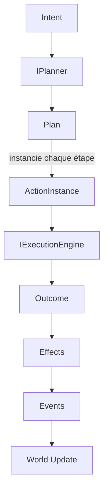

# ENGINE-006 — Action Pipeline

> Version : 1.2
> Statut : Proposition
> Maturité : 2
> Bibliothèque : ENGINE

⸻

# 1. Objectif

Traduire le modèle conceptuel du pipeline d'action (ACT-002-F, section
3bis : Intent → Plan → Action Instance → Execution Engine → Effects →
Events → World Update → Outcome, enrichi par ACT-004 à ACT-010) en une
architecture concrète --- types, interfaces, machine à états --- prête à
être implémentée dans `CHRONIQUES-ENGINE`.

Ce document précède tout code (Maturité 2, Spécification --- MASTER-007),
conformément à ENGINE-000, section 3 : aucune implémentation du pipeline
d'action ne doit commencer avant sa validation.

Ce document ne redéfinit aucun concept déjà posé par ACT. Il traduit :
chaque type ci-dessous porte le nom de son concept ACT d'origine et cite
la section qu'il implémente, jamais une règle nouvelle.

---

# 2. Principe

Une Action Instance n'exécute aucune logique elle-même (ACT-002-F,
section 2) --- elle représente un état, transformé par un Execution
Engine externe. Ce principe, déjà appliqué par le Kernel existant
(ENGINE-002 : « le Kernel ne contient aucune donnée métier ni aucune
règle de jeu »), s'étend ici à l'ensemble du pipeline : chaque type
défini ci-dessous est soit une donnée immuable (Intent, Action
Definition, Action Contract), soit un état mutable dépourvu de logique
propre (Action Instance), soit un service sans état (Planner, Execution
Engine).

---

# 3. Responsabilités

| Concept ACT | Type ENGINE | Responsabilité |
|---|---|---|
| Intent (ACT-002-H) | `Intent` | décrit un objectif, jamais une méthode |
| Planner (ACT-002-H, ACT-002-I) | `IPlanner` | choisit des Action Definitions, produit un Plan |
| Plan (ACT-002-I) | `Plan` | organise des étapes, ne décide ni n'exécute |
| Action Definition (ACT-002-D) | `ActionDefinition` | décrit, immuable |
| Action Contract (ACT-002-E) | `ActionContract` | spécifie Inputs/Preconditions/Constraints/Costs/Effects/Events |
| Action Instance (ACT-002-D, ACT-001-F) | `ActionInstance` | représente une exécution, porte un état |
| Execution Engine (ACT-002-F) | `IExecutionEngine` | interprète une Action Instance |
| Outcome (ACT-002-G) | `Outcome` | résultat observé, produit avant les Effects |

Aucun type ne peut assumer la responsabilité d'un autre --- une
`ActionInstance` ne planifie jamais, un `Plan` n'exécute jamais
(ACT-002-I, section 9).

---

# 4. Architecture

## 4.1 Intent

```csharp
public sealed record Intent(
    EntityId Acteur,
    string Objectif,
    int Priorite);
```

Implémente ACT-002-H. Ne référence jamais une Action, un Effect ou un
Event (ACT-002-H, section Indépendance) --- aucun champ de ce record ne
peut donc pointer vers `ActionInstance` ni `Outcome`, ni maintenant ni
dans une future version.

## 4.2 Planner

```csharp
public interface IPlanner
{
    Plan CreatePlan(Intent intent, World world);
}
```

Implémente la « Production » d'ACT-002-H : « Un Intent est interprété
par un Planner. Le Planner choisit une ou plusieurs Action
Definitions. » Le Planner est un service sans état --- il ne conserve
aucune référence entre deux appels ; c'est le `Plan` qu'il produit qui
porte l'état à réévaluer (ACT-002-I, section 7).

## 4.3 Plan

```csharp
public enum PlanStepMode { Sequentiel, Parallele, Optionnel, Conditionnel }

public sealed record PlanStep(
    ActionDefinition Definition,
    PlanStepMode Mode,
    IReadOnlyList<PlanStep> DependsOn);

public sealed class Plan
{
    public Intent Intent { get; }
    public IReadOnlyList<PlanStep> Steps { get; private set; }

    public void Adapter(IReadOnlyList<PlanStep> nouvellesEtapes) { /* ACT-002-I section 7 */ }
    public void Abandonner() { /* ACT-002-I section 7 */ }
    public void Reconstruire(IPlanner planner, World world) { /* ACT-002-I section 7 */ }
}
```

Implémente ACT-002-I. Les quatre `PlanStepMode` correspondent
exactement aux quatre natures d'étape de la section 5 : « une étape peut
être séquentielle, parallèle, optionnelle, conditionnelle. » Les
dépendances entre étapes (`DependsOn`) ne peuvent jamais former de cycle
(ACT-002-I, section 6 : « les dépendances circulaires sont
interdites »).

## 4.4 Action Definition et Action Contract

```csharp
public sealed record ActionDefinition(
    string Verbe,
    string Pattern,
    string Principe,
    ActionContract Contract);

public sealed record ActionContract(
    IReadOnlyList<InputSlot> Inputs,
    IReadOnlyList<Condition> Preconditions,
    IReadOnlyList<Condition> Constraints,
    IReadOnlyList<CostSlot> Costs,
    IReadOnlyList<ConsequenceTemplate> Effects,
    IReadOnlyList<EventTemplate> Events);
```

`ActionDefinition` implémente ACT-002-D, section 3, et porte la chaîne
de traçabilité exigée par sa section 8 (Verbe → Pattern → Principe,
ACT-002-B/C). `ActionContract` implémente ACT-002-E ; `Condition` est
catégorisée selon ACT-006-A, section 3 (Physique, Possession, Coût,
État, Légal, Social, Temporel, Narratif) ; `ConsequenceTemplate` selon
ACT-007-A, section 3 (Matérielle, Relationnelle, Informationnelle,
Statutaire, Narrative) ; `EventTemplate` selon ACT-010-A, section 3
(Transition, Fait, Notification, Narratif).

Les deux types sont des `record` --- immuables par construction
(ACT-002-D, section 7 ; ACT-002-F, section 5).

## 4.5 Action Instance

```csharp
public enum ActionState
{
    Created, Validated, Planned, Prepared, Running,
    Suspended, Interrupted, Succeeded, Failed,
    Resolved, Committed, Archived
}

public sealed class ActionInstance
{
    public EntityId Id { get; }
    public Tick CreatedAt { get; }
    public ActionDefinition Definition { get; }
    public ActionState State { get; private set; }
    public EntityId Acteur { get; }
    public IReadOnlyList<CibleRef> Cibles { get; }
    public Outcome? Outcome { get; private set; }

    internal void Transition(ActionState nouvelEtat) { /* section 6 */ }
}

public sealed record CibleRef(EntityId Cible, RoleCible Role);
public enum RoleCible { Principale, Secondaire }
```

`ActionState` reprend exactement les douze états d'ACT-001-F, section 3
--- aucun renommage, aucun état supplémentaire. `CibleRef` et
`RoleCible` implémentent ACT-005-A, section 6 : une Action Instance
référence toujours exactement une Cible de rôle Principale, et zéro ou
plusieurs de rôle Secondaire.

## 4.6 Execution Engine et Outcome

```csharp
public interface IExecutionEngine
{
    Outcome Execute(ActionInstance instance, World world);
}

public enum OutcomeForme { Reussite, ReussitePartielle, Echec, Interruption }

public sealed record Outcome(OutcomeForme Forme);
```

Implémente ACT-002-F (Execution Engine) et ACT-002-G (Outcome). Les
quatre valeurs d'`OutcomeForme` reprennent exactement les formes de
l'Outcome (ACT-002-G, section Formes), sans en ajouter ni en retirer.
`IExecutionEngine.Execute` ne modifie jamais directement le World : il
produit un `Outcome`, qui précède toujours la production des Effects
(ACT-002-G, section Caractéristiques --- « précède les Effets »). C'est
un appel séparé, décrit en section 5, qui applique les Effects.

---

# 5. Flux



Ce flux traduit exactement ACT-002-F, section 3bis, sans en modifier
l'ordre ni les invariants : un Intent ne produit jamais directement un
Outcome, il traverse toujours un Plan puis au moins une Action Instance
et le moteur d'exécution ; un Outcome ne remonte jamais vers l'Intent
qui l'a motivé.

---

# 6. Machine à états de l'Action Instance

Les transitions autorisées reprennent exactement ACT-001-F, section 6 :

```
Created → Validated → Planned → Prepared → Running
Running → Succeeded | Failed
Succeeded | Failed → Resolved → Committed → Archived

Running ↔ Suspended
Running ↔ Interrupted → Running | Failed
```

Failed et Archived sont terminaux (ACT-001-F, section 4) : une fois
atteints, `ActionInstance.Transition` refuse toute transition
supplémentaire.

Les trois catégories d'échec d'ACT-002-F, section 8bis, déterminent le
chemin emprunté :

- **invalidité interne** (Precondition/Constraint violée) : transition
  directe vers `Failed`, jamais par `Running` --- l'instance n'aurait
  jamais dû l'atteindre ;
- **disparition** (Acteur/Cible principale disparu) : transition depuis
  `Running` vers `Failed`, avec conservation des Effects déjà produits
  (ACT-002-F, section 8bis) ;
- **ressources** (Ressource devenue indisponible) : transition depuis
  `Running` vers `Failed`, avec libération des ressources réservées.

La disparition d'une Cible secondaire ne provoque jamais cette
transition (ACT-005-A, section 8) --- l'instance reste `Running`, la
Cible est simplement retirée de `Cibles`.

---

# 7. Composition

Une `ActionInstance` composite (ACT-009-A) référence une liste
ordonnée de sous-`ActionInstance`, chacune marquée essentielle ou non
essentielle par l'`ActionContract` de l'instance composite :

```csharp
public sealed record SubActionRef(ActionInstance Instance, bool Essentielle);
```

Toutes les sous-instances héritent de l'`Acteur` de l'instance composite
(ACT-009-A, section 5) --- `ActionInstance` ne permet aucune
construction où une sous-instance porterait un `Acteur` différent. La
propagation d'échec et l'agrégation de l'`Outcome` suivent exactement
ACT-009-A, sections 4 et 6 : l'échec d'une sous-instance essentielle
transite l'ensemble vers `Failed` ; l'échec d'une sous-instance non
essentielle ne le fait jamais.

Un `Plan` (section 4.3) n'est jamais une `ActionInstance` composite,
même s'il organise plusieurs Actions : la frontière tranchée par
ACT-009-A, section 3, s'applique intégralement ici --- un `Plan` peut
être reconstruit, ses étapes ne sont jamais fixes ; une `ActionInstance`
composite a une décomposition figée dès sa création.

---

# 8. Contrat

Une `ActionInstance` ne peut jamais exécuter de logique propre --- toute
transformation passe par un `IExecutionEngine` externe.

Un `Intent`, une `ActionDefinition` et un `ActionContract` sont toujours
immuables après création --- seule une `ActionInstance` porte un état
qui évolue.

Un `Outcome` précède toujours la production des Effects, jamais
l'inverse.

Aucune transition d'`ActionState` non listée en section 6 n'est
autorisée.

---

# 9. Contrat TECH

Le moteur doit être capable de :

- construire un `Plan` à partir d'un `Intent` via un `IPlanner`, sans
  jamais construire d'`ActionInstance` directement depuis un `Intent` ;
- refuser toute transition d'`ActionState` non listée en section 6 ;
- appliquer les trois catégories d'échec (section 6) selon la cause
  réelle, sans les confondre ;
- garantir qu'une `ActionInstance` composite ne référence jamais une
  sous-instance à l'Acteur différent ;
- garantir que `IExecutionEngine.Execute` ne modifie jamais directement
  le World --- seule l'application des Effects, en aval de l'Outcome, le
  fait.

---

# 10. Contrat QA

Les tests devront vérifier :

✓ qu'un `Intent` ne référence jamais une `ActionInstance` ni un
`Outcome`, à la compilation comme à l'exécution ;

✓ que les douze valeurs d'`ActionState` et leurs transitions autorisées
correspondent exactement à ACT-001-F ;

✓ qu'une transition non listée est toujours refusée ;

✓ que les quatre `OutcomeForme` correspondent exactement à ACT-002-G ;

✓ qu'une `ActionInstance` composite propage l'échec d'une sous-instance
essentielle et jamais celui d'une non essentielle ;

✓ qu'une disparition de Cible secondaire ne fait jamais transiter
l'instance vers `Failed`.

---

# 11. Critères de validation

Ce document est conforme si :

✓ chaque type porte un renvoi explicite vers le concept ACT qu'il
implémente ;

✓ aucun champ ni aucune méthode n'introduit une règle absente d'ACT-002
ou d'ACT-004 à ACT-010 ;

✓ la machine à états (section 6) reproduit exactement ACT-001-F, sans
ajout ni omission ;

✓ la frontière Plan / Action composite (section 7) reste celle tranchée
par ACT-009-A, sans la rouvrir.

---

# 12. Historique

## Version 1.2

- Preuve d'intégration de bout en bout, dans
  `Simulation/Chroniques.Simulation/Actions/Exemples/` : un unique Verbe
  de démonstration (« Se reposer », `SimplePlanner`,
  `SimpleExecutionEngine`, `PipelineRunner`) exerçant Intent → Planner →
  Plan → Action Instance → Execution Engine → Outcome → Effects → Events
  réellement, pas seulement chaque pièce isolément. Ce n'est jamais un
  Verbe officiel (ACT-008-A, section 1 : l'énumération des Verbes
  appartient à VERBS, piloté par GDB) --- uniquement une validation
  d'architecture. 4 tests d'intégration ajoutés
  (`PipelineIntegrationTests`), en complément d'`ActionInstanceTests` et
  `PlanTests` (unitaires). 91 tests existants confirmés passants avant
  cet ajout (compilation et exécution réelles, hors de cet
  environnement).

## Version 1.1

- Première implémentation, dans `Simulation/Chroniques.Simulation/Actions/`
  (`CHRONIQUES-ENGINE`). Toutes les citations vérifiées avant livraison
  (audit formel) ; aucun constat trouvé. Deux ajouts au-delà des
  esquisses C# illustratives de ce document, cohérents avec le texte des
  sections concernées mais non nommés explicitement dans les extraits de
  code : `PlanStatus` (Actif/Suspendu/Abandonné, réalise la prose de la
  section 4.3 sur la réévaluation d'un Plan) et les types complets des
  taxonomies ACT-006/007/010 (`ConditionCategorie`, `ConsequenceTemplate`
  et ses trois dimensions, `EventTemplate`), esquissés en prose ici mais
  détaillés en code. Maturité laissée à 2 : une vérification dédiée
  identifiant pour identifiant reste à faire avant de passer à 3
  (MASTER-007).

## Version 1.0

- Création du document. Traduit ACT-002-D à J et ACT-004-A à ACT-010-A
  en une architecture concrète --- types, machine à états, règles de
  composition --- prête à guider l'implémentation du pipeline d'action
  dans `CHRONIQUES-ENGINE`. Statut Proposition, Maturité 2
  (Spécification) : précède toute implémentation, conformément à
  ENGINE-000, section 3.
