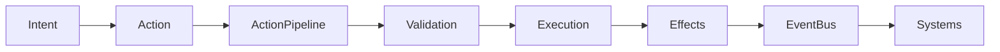
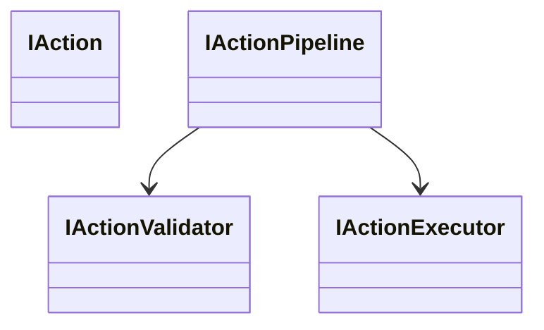
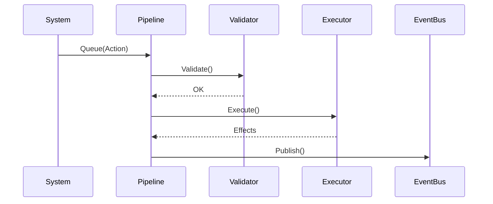

# ENGINE-006 — Action Pipeline

**Version :** 1.0  
**Statut :** Validé  
**Bibliothèque :** ENGINE  
**Composant :** Action Pipeline

---

# 1. Objectif

Le présent document définit l'architecture du **Pipeline d'Actions** utilisé par le moteur Chroniques.

Le Pipeline d'Actions est responsable de l'exécution déterministe des actions entreprises par les entités du monde simulé.

Il constitue le lien entre les intentions produites par les systèmes de simulation et les modifications effectives du World.

---

# 2. Responsabilités

Le Pipeline d'Actions est responsable de :

- recevoir les actions à exécuter ;
- valider leur exécution ;
- exécuter les effets ;
- publier les événements générés ;
- garantir un ordre déterministe d'exécution.

---

# 3. Hors périmètre

Le Pipeline n'est pas responsable de :

- décider des actions ;
- calculer l'IA ;
- mettre à jour les besoins ;
- gérer le Scheduler ;
- gérer le Tick ;
- sauvegarder le World.

Ces responsabilités appartiennent à d'autres composants du moteur.

---

# 4. Vue d'ensemble



---

# 5. Position dans le moteur

```text
Scheduler
        │
        ▼
Systems
        │
        ▼
Action Pipeline
        │
        ▼
World
        │
        ▼
EventBus
```

Le Pipeline est exécuté après les Systems et avant la publication des événements.

---

# 6. Cycle d'exécution

Chaque Tick suit le processus suivant :

1. Les Systems produisent des Actions.
2. Les Actions sont ajoutées au Pipeline.
3. Le Pipeline traite les Actions dans l'ordre.
4. Chaque Action est validée.
5. Les effets sont appliqués au World.
6. Les événements sont publiés.
7. Le Tick continue.

---

# 7. Architecture



---

# 8. Contrats

## IAction

Représente une action exécutable.

Responsabilités :

- identifier le type d'action ;
- transporter les données nécessaires.

Le contrat ne contient aucune logique métier.

---

## IActionValidator

Responsable de vérifier qu'une action peut être exécutée.

Exemples :

- l'entité existe ;
- la cible existe ;
- les ressources sont suffisantes.

---

## IActionExecutor

Responsable d'appliquer les effets d'une action.

Il ne décide jamais si l'action doit être réalisée.

---

## IActionPipeline

Coordonne l'ensemble du processus.

Il garantit :

- l'ordre d'exécution ;
- le déterminisme ;
- la publication des événements.

---

# 9. Séquence d'exécution



---

# 10. Déterminisme

Le Pipeline doit être strictement déterministe.

À Tick identique :

- même ordre d'Actions ;
- mêmes validations ;
- mêmes effets ;
- mêmes événements.

Aucune exécution parallèle n'est autorisée.

---

# 11. Ordonnancement

Les Actions sont exécutées dans leur ordre d'arrivée.

Version 1.0 :

FIFO.

Aucune priorité.

---

# 12. Gestion des erreurs

Une Action invalide :

- est rejetée ;
- ne modifie pas le World ;
- peut générer un événement d'échec.

Le Pipeline poursuit ensuite son exécution.

---

# 13. Effets

Une Action peut produire :

- modification d'un composant ;
- création d'entité ;
- suppression d'entité ;
- changement d'état ;
- publication d'événements.

Les effets sont appliqués uniquement par l'Executor.

---

# 14. Publication des événements

Une fois les effets appliqués :

- les événements sont publiés ;
- les abonnés sont notifiés ;
- le Pipeline passe à l'action suivante.

Le Pipeline ne conserve aucun historique.

---

# 15. Invariants

Les règles suivantes sont immuables.

## Déterminisme

Même entrée.

Même sortie.

Toujours.

---

## Isolation

Une Action ne peut modifier que le World fourni.

---

## Validation obligatoire

Aucune Action n'est exécutée sans validation préalable.

---

## Exécution unique

Une Action ne peut être exécutée qu'une seule fois.

---

## Pas de parallélisme

Version 1.0 :

Toutes les Actions sont exécutées séquentiellement.

---

# 16. Complexité

| Opération | Complexité |
|------------|------------|
| Ajout d'une Action | O(1) |
| Validation | O(1) à O(n) |
| Exécution | dépend de l'Action |
| Publication | O(nombre de Handlers) |

---

# 17. Tests unitaires

Les tests suivants sont obligatoires.

## Queue_Should_Add_Action

Une Action est correctement ajoutée.

---

## Execute_Should_Process_Actions_In_Order

Les Actions sont exécutées dans l'ordre FIFO.

---

## Invalid_Action_Should_Not_Modify_World

Une Action invalide ne produit aucun effet.

---

## Execute_Should_Publish_Events

Les événements sont publiés après l'exécution.

---

## Execute_Should_Process_All_Queued_Actions

Toutes les Actions présentes dans la file sont exécutées.

---

## Execute_Should_Not_Execute_Action_Twice

Une Action ne peut jamais être rejouée.

---

# 18. Critères de validation

Le composant est considéré comme terminé lorsque :

- toutes les Actions sont déterministes ;
- aucun parallélisme n'existe ;
- tous les tests passent ;
- les événements sont correctement publiés ;
- les Actions invalides ne modifient jamais le World.

---

# 19. Évolutions futures

Les évolutions suivantes sont prévues :

- priorités d'Actions ;
- pipeline configurable ;
- instrumentation ;
- métriques ;
- journalisation ;
- replay déterministe ;
- rollback transactionnel.

Ces évolutions ne devront pas modifier les contrats publics.

---

# 20. Historique

| Version | Description |
|----------|-------------|
| 1.0 | Première spécification du Pipeline d'Actions. |