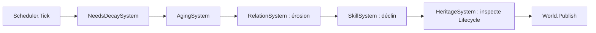

# ENGINE-008 — Systems de population (Relations, Compétences, Héritage)

> Version : 1.4
> Statut : Validée
> Maturité : 4
> Bibliothèque : ENGINE

⸻

# 1. Objectif

Traduire GDB-004C (Les Relations Sociales), GDB-004H (Les Compétences) et
GDB-004J (La Transmission) en architecture concrète --- types, Systems,
formules --- implémentée dans `CHRONIQUES-ENGINE`.

Ce document a précédé l'implémentation conformément à ENGINE-000,
section 3. Après spécification, implémentation et validation par tests,
il constitue désormais le contrat architectural de référence des
Systems de population couverts par ce lot.

Il correspond à une partie de la cible « relations, mémoire, compétences,
héritage minimal » de PROD/FeuilleDeRoute.md pour v0.3.

La mémoire n'est pas couverte par ENGINE-008 et reste à spécifier
séparément avant implémentation.

Ce document ne redéfinit aucun concept déjà posé par la GDB. Chaque type
ci-dessous porte le nom de son concept GDB d'origine et cite la section
qu'il implémente, jamais une règle métier nouvelle.

---

# 2. Principe

Toute la logique vit dans les Systems, jamais dans les Components qu'ils
font évoluer (CORE-003-C) --- même principe qu'ENGINE-004.

Les paramètres numériques :

- taux d'érosion ;
- seuils ;
- capacités ;
- facteurs de progression ;
- taux de déclin ;

sont des paramètres de constructeur, jamais des constantes métier
cachées dans les Systems.

Cette règle est directement cohérente avec GDB-004C, GDB-004H,
NeedsDecaySystem et AgingSystem.

---

# 3. Responsabilités

## RelationComponent / RelationSystem

Implémente GDB-004C.

`RelationComponent` porte la liste des relations actives d'un habitant.

`RelationSystem` est responsable de :

- l'érosion naturelle de la Force de chaque relation à chaque Tick ;
- l'application du plancher familial ;
- l'enregistrement d'une interaction qualifiante ;
- la création d'une relation lorsqu'elle n'existe pas ;
- l'application de l'impact d'une interaction ;
- la création d'un Épisode lorsque l'ampleur franchit le seuil
  d'importance ;
- l'éviction du plus ancien Épisode lorsque la capacité maximale est
  dépassée ;
- la suppression d'une relation dont la Force atteint 0.

Il n'est jamais responsable de la Réputation, définie par GDB-004I et
différée à une phase ultérieure.

---

## SkillComponent / SkillSystem

Implémente GDB-004H.

`SkillComponent` porte les Compétences d'un habitant, chacune identifiée
par son nom.

`SkillSystem` est responsable de :

- créer une Compétence lors de sa première pratique qualifiante ;
- enregistrer la dernière pratique ;
- appliquer un gain de Niveau ;
- faire décroître ce gain à mesure que le Niveau approche 100 ;
- appliquer le déclin d'une Compétence après un seuil d'inactivité ;
- maintenir le Niveau entre 0 et 100.

---

## HeritageSystem

Implémente la partie actuellement représentable de GDB-004J.

`HeritageSystem` ne porte aucun Component propre.

Il utilise :

- `Lifecycle` pour détecter la mort ;
- `RelationComponent` pour désigner un héritier.

Il détecte directement :

```text
Lifecycle.CurrentState.Name == "mort"
```

et ne lit jamais `World.Events` pour décider d'agir.

`World.Events` reste un journal d'observabilité conforme à ENGINE-001,
jamais un canal de coordination entre Systems.

`HeritageSystem` est responsable de :

- détecter une Entity morte non encore traitée ;
- garantir une seule tentative de transmission par Entity morte ;
- désigner l'héritier de manière déterministe ;
- traiter l'absence de successeur ;
- traiter le refus d'héritage ;
- publier les `GameEvent` observables associés.

La transmission matérielle complète reste différée tant qu'aucune
représentation du patrimoine transmissible n'existe dans le moteur.

---

# 4. Architecture

## 4.1 Relations

```csharp
public enum TypeRelation
{
    Familiale,
    Amicale,
    Professionnelle,
    Commerciale,
    Politique,
    Conflictuelle,
    Sentimentale
}

public sealed record Episode(
    Tick Tick,
    string Description,
    double Impact);

public sealed class Relation
{
    public EntityId Cible { get; }

    public TypeRelation Type { get; }

    public double Force { get; internal set; }

    public Tick CreeeAu { get; }

    public IReadOnlyList<Episode> Episodes { get; }
}

public sealed class RelationComponent : IComponent
{
    public IReadOnlyList<Relation> Relations { get; }
}
```

`RelationSystem` porte notamment comme paramètres :

- taux d'érosion par Tick ;
- plancher familial ;
- seuil d'importance d'un Épisode ;
- capacité maximale d'Épisodes ;
- Force initiale d'une nouvelle relation.

Ces valeurs ne sont volontairement pas imposées par ENGINE-008.

---

## 4.2 Plancher familial

Le plancher familial protège exclusivement contre l'érosion naturelle.

Si :

```text
Force > plancher familial
```

l'érosion peut faire diminuer la Force jusqu'au plancher, mais jamais
au-dessous.

Exemple :

```text
Force = 12
Plancher = 10
Érosion = 5

Résultat = 10
```

En revanche, une interaction négative peut faire tomber la Force
sous ce plancher.

Exemple :

```text
Force = 40
Interaction = -35

Résultat = 5
```

Une fois sous le plancher, l'érosion naturelle :

- ne diminue pas davantage la relation Familiale ;
- ne la remonte surtout pas artificiellement vers le plancher.

Ainsi :

```text
Force = 5
Plancher = 10
Tick suivant

Résultat = 5
```

et jamais :

```text
5 → 10
```

Une interaction négative suffisamment forte peut atteindre `0`.

Dans ce cas, la relation Familiale disparaît.

Le lien familial est donc protégé contre le seul écoulement du temps,
pas contre une rupture produite par les interactions.

---

## 4.3 Compétences

```csharp
public sealed class Competence
{
    public double Niveau { get; internal set; }

    public Tick DernierePratique { get; internal set; }
}

public sealed class SkillComponent : IComponent
{
    public IReadOnlyDictionary<string, Competence> Competences { get; }
}
```

`SkillSystem` porte :

- facteur de gain par pratique ;
- seuil d'inactivité ;
- taux de déclin.

Le gain d'une pratique est strictement décroissant en fonction du Niveau
courant.

À Niveau `0`, le gain est maximal.

À mesure que le Niveau approche `100`, le gain marginal approche `0`.

La forme mathématique précise peut évoluer sans remettre en cause le
contrat si les propriétés suivantes restent respectées :

```text
gain(Niveau A) > gain(Niveau B)
si Niveau A < Niveau B
```

et :

```text
0 <= Niveau <= 100
```

---

## 4.4 Héritage

`HeritageSystem` utilise le `Lifecycle` défini par ENGINE-002.

La détection repose uniquement sur l'état de l'Entity :

```text
Lifecycle
↓
State = "mort"
↓
HeritageSystem
```

et non sur :

```text
World.Events
```

L'algorithme de désignation suit :

```text
Relations disponibles
↓
Relations Familiales ?
    │
    ├── oui → garder uniquement les Familiales
    │
    └── non → utiliser les autres relations
↓
Force la plus élevée
↓
égalité ?
↓
relation la plus ancienne
```

Si aucune Entity valide ne peut être désignée :

```text
heritage.absence-successeur
```

est publié.

---

## 4.5 Refus d'héritage

GDB-004J autorise un héritier à refuser tout ou partie de l'héritage.

Le chemin architectural retenu est :

```text
Intent
↓
Action Pipeline
↓
HeritageRefusalEffect
↓
PopulationEffectApplicator
↓
HeritageSystem.RefuserHeritage
↓
GameEvent observable
```

`PopulationEffectApplicator` ne possède aucune logique métier
d'héritage.

Il se contente de router :

```text
HeritageRefusalEffect
```

vers :

```text
HeritageSystem
```

qui constitue l'unique source de vérité de cette logique.

En Phase 1, le moteur ne représentant pas encore le patrimoine matériel,
le refus produit l'événement observable :

```text
heritage.refus
```

La redistribution réelle de la part refusée est différée jusqu'à
l'existence d'un système de patrimoine.

---

## 4.6 Transmission incomplète

GDB-004J définit également le cas :

```text
Transmission incomplète
```

Ce cas est **spécifié conceptuellement mais non implémenté dans le lot
ENGINE-008 actuel**.

Sa réalisation nécessite notamment des représentations qui n'existent
pas encore dans le moteur :

- patrimoine matériel ;
- éléments transmissibles ;
- règles de redistribution ;
- éventuellement connaissances ou compétences héritables.

Conformément à MASTER-006, ENGINE-008 n'anticipe pas ces structures.

La transmission incomplète reste donc :

```text
SPÉCIFIÉE PAR GDB
↓
DIFFÉRÉE
↓
NON TESTÉE DANS ENGINE-008 ACTUEL
```

Elle devra faire l'objet d'une extension de spécification avant son
implémentation.

---

# 5. Flux

## 5.1 Flux temporel



`HeritageSystem` doit être enregistré après `AgingSystem`.

Ainsi, lorsqu'une Entity meurt pendant le Tick :

```text
AgingSystem
↓
Lifecycle = mort
↓
HeritageSystem
```

peut constater immédiatement ce nouvel état.

---

## 5.2 Flux déclenché par une Action

Les mutations provoquées par une Action ne passent pas directement du
pipeline vers un System concret.

Le flux est :

```text
Action Instance
↓
Execution Engine
↓
Effects typés
↓
EffectApplicator / Resolver
↓
System métier responsable
↓
World
```

Le pipeline d'Actions ne connaît donc aucun System d'ENGINE-008.

---

## 5.3 Effects de population

Les Effects actuellement représentés comprennent :

```text
RelationInteractionEffect
SkillPracticeEffect
HeritageRefusalEffect
```

Le dispatch est :

```text
RelationInteractionEffect
↓
RelationSystem.EnregistrerInteraction
```

```text
SkillPracticeEffect
↓
SkillSystem.Pratiquer
```

```text
HeritageRefusalEffect
↓
HeritageSystem.RefuserHeritage
```

`PopulationEffectApplicator` constitue le mécanisme de résolution
actuellement spécialisé pour ces Effects de population.

---

# 6. Contrat

## RelationSystem

- La Force reste toujours comprise entre `0` et `100`.
- Une relation Familiale située au-dessus de son plancher ne descend
  jamais sous celui-ci par la seule érosion.
- Une relation Familiale déjà sous son plancher n'est jamais remontée
  artificiellement par l'érosion.
- Une interaction négative peut faire passer une relation Familiale sous
  son plancher.
- Une interaction négative peut faire atteindre `0` et supprimer une
  relation Familiale.
- Un Épisode n'est créé que lorsque l'impact franchit le seuil
  d'importance.
- Lorsque la capacité d'Épisodes est dépassée, le plus ancien est retiré.

---

## SkillSystem

- Le Niveau reste compris entre `0` et `100`.
- Le gain d'une pratique décroît strictement lorsque le Niveau augmente.
- Le gain tend vers zéro à proximité du Niveau `100`.
- Le déclin n'est jamais appliqué avant le seuil d'inactivité.
- Une pratique met à jour la dernière date de pratique.

---

## HeritageSystem

- Une Entity morte déjà traitée n'est jamais retraitée.
- La mort est détectée par `Lifecycle`, jamais par lecture de
  `World.Events`.
- La désignation de l'héritier est déterministe.
- Les relations Familiales ont priorité.
- À type prioritaire identique, la Force la plus élevée gagne.
- À Force identique, la relation la plus ancienne gagne.
- L'absence de successeur produit un événement observable.
- Le refus d'héritage est traité par `HeritageSystem`.
- `PopulationEffectApplicator` ne contient aucune règle métier
  d'héritage.
- La transmission incomplète reste différée jusqu'à la représentation
  du patrimoine.

---

# 7. Invariants

- Un Component absent n'est jamais une erreur pour un System :
  l'Entity est ignorée silencieusement lorsque le contrat le permet.
- `HeritageSystem` ne modifie jamais directement `RelationComponent`.
- Seul `RelationSystem` possède la logique de mutation des relations.
- Seul `SkillSystem` possède la logique de progression et de déclin des
  Compétences.
- `HeritageSystem` constitue la source de vérité de la logique
  d'héritage actuellement implémentée.
- Aucun System ne lit `World.Events` afin de décider d'agir.
- `World.Events` reste un journal d'observabilité.
- ENGINE-006 ne dépend d'aucun System concret d'ENGINE-008.
- Les mutations déclenchées par une Action passent par des Effects
  typés et leur mécanisme de résolution.
- Aucun événement n'est publié sans événement métier réel correspondant.

---

# 8. Validation

L'implémentation associée a été compilée et validée dans
`CHRONIQUES-ENGINE`.

Résultat courant :

```text
dotnet build
→ succès

dotnet test
→ 122 / 122 tests réussis
→ 0 échec
```

## RelationSystemTests

Couvrent notamment :

- érosion naturelle ;
- plancher familial ;
- relation Familiale au-dessus du plancher descendant jusqu'au plancher ;
- relation Familiale sous le plancher ne remontant jamais artificiellement ;
- rupture d'une relation Familiale par interaction négative ;
- création d'une relation ;
- disparition à Force 0 ;
- création d'un Épisode au-dessus du seuil ;
- absence d'Épisode sous le seuil ;
- éviction du plus ancien Épisode ;
- `RelationInteractionEffect`.

---

## SkillSystemTests

Couvrent notamment :

- gain maximal depuis Niveau 0 ;
- gain décroissant avec le Niveau ;
- saturation à proximité de Niveau 100 ;
- absence de déclin avant le seuil d'inactivité ;
- déclin après le seuil ;
- `SkillPracticeEffect`.

---

## HeritageSystemTests

Couvrent notamment :

- priorité Familiale ;
- tie-break par ancienneté ;
- transmission observable lorsqu'un héritier existe ;
- absence de successeur ;
- absence de `RelationComponent` ;
- non-retraitement d'une Entity morte déjà traitée ;
- refus d'héritage ;
- absence de publication pour des Entities invalides ;
- dispatch de `HeritageRefusalEffect` vers `HeritageSystem`.

Ne couvre volontairement pas encore :

```text
Transmission incomplète
```

car le patrimoine transmissible n'a pas encore de représentation
implémentée.

---

# 9. Historique

## Version 1.4

- Passage à **Maturité 4** après implémentation et validation.
- Compilation du moteur confirmée.
- **122 / 122 tests réussis, 0 échec.**
- Correction du bug de plancher familial :
  une relation Familiale passée sous le plancher par interaction négative
  n'est plus remontée artificiellement par l'érosion naturelle.
- Ajout de deux tests de non-régression sur le plancher familial.
- `HeritageRefusalEffect` est désormais dispatché par
  `PopulationEffectApplicator` vers `HeritageSystem.RefuserHeritage`.
- `HeritageSystem` devient l'unique source de vérité pour la logique de
  refus d'héritage.
- Tests du refus enrichis.
- Correction de la Validation :
  la « transmission incomplète » n'est plus présentée comme implémentée
  ou testée. Elle reste différée jusqu'à l'existence du patrimoine
  transmissible.
- Objectif actualisé : le document a précédé l'implémentation mais
  constitue désormais son contrat architectural validé.

## Version 1.3

- Passage du statut Proposition à Validée.
- Cas limite du plancher familial spécifié.
- Décroissance du gain de Compétence verrouillée.
- Mécanisme conceptuel de refus d'héritage introduit.
- Contrat de non-retraitement d'une Entity morte clarifié.

## Version 1.2

- `HeritageSystem` cesse de lire `World.Events` pour détecter la mort.
- La mort est désormais détectée directement via `Lifecycle`.
- Introduction des Effects typés et du mécanisme de résolution afin de
  découpler ENGINE-006 des Systems de population.

## Version 1.1

- Clarification initiale du flux d'héritage.
- Ajout des chemins d'interaction et de pratique hors `Update`.

## Version 1.0

- Création du document.
- Traduction initiale de GDB-004C, GDB-004H et GDB-004J en architecture
  ENGINE.
