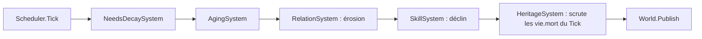

# ENGINE-008 — Systems de population (Relations, Compétences, Héritage)

> Version : 1.0
> Statut : Proposition
> Maturité : 2
> Bibliothèque : ENGINE

⸻

# 1. Objectif

Traduire GDB-004C (Les Relations Sociales), GDB-004H (Les Compétences) et
GDB-004J (La Transmission) en architecture concrète --- types, Systems,
formules --- prête à être implémentée dans `CHRONIQUES-ENGINE`.

Ce document précède tout code (Maturité 2, Spécification --- MASTER-007),
conformément à ENGINE-000, section 3. Il correspond à la cible « relations,
mémoire, compétences, héritage minimal » de PROD/FeuilleDeRoute.md pour
v0.3, qui atteint le critère de sortie de la Phase 1 de MASTER-005.

Ce document ne redéfinit aucun concept déjà posé par la GDB. Chaque
type ci-dessous porte le nom de son concept GDB d'origine et cite la
section qu'il implémente, jamais une règle nouvelle.

---

# 2. Principe

Toute la logique vit dans les Systems, jamais dans les Components qu'ils
font évoluer (CORE-003-C) --- même principe qu'ENGINE-004.

Les paramètres numériques (taux d'érosion, seuils, capacités) sont des
paramètres de constructeur, jamais des constantes internes ---
directement exigé par GDB-004C et GDB-004H eux-mêmes (section
« Paramètres d'implémentation » des deux documents), et cohérent avec
NeedsDecaySystem/AgingSystem (ENGINE-004).

---

# 3. Responsabilités

## RelationComponent / RelationSystem

Implémente GDB-004C. `RelationComponent` porte la liste des relations
actives d'un habitant. `RelationSystem` est responsable de :

- l'érosion naturelle de la Force de chaque relation à chaque Tick, avec
  un plancher non nul pour les relations de type Familiale (GDB-004C,
  ÉVOLUTION) ;
- l'enregistrement d'une interaction qualifiante --- création de la
  relation si elle n'existe pas encore, application de l'effet
  d'interaction, création d'un Épisode si l'ampleur franchit le seuil
  d'importance, éviction du plus ancien Épisode au-delà de la capacité
  (GDB-004C, ÉPISODES) ;
- la suppression d'une relation dont la Force atteint 0 (sauf plancher
  familial).

N'est jamais responsable de la Réputation (GDB-004I) --- différée à
MASTER-005 Phase 3 (GDB-004C, FRONTIÈRE AVEC GDB-004I).

## SkillComponent / SkillSystem

Implémente GDB-004H. `SkillComponent` porte les Compétences d'un
habitant, chacune identifiée par son nom. `SkillSystem` est responsable
de :

- le déclin du Niveau d'une Compétence non pratiquée au-delà d'un seuil
  d'inactivité (GDB-004H, MODÈLE DE PROGRESSION) ;
- l'enregistrement d'une pratique qualifiante --- gain de Niveau
  décroissant à mesure que le Niveau approche 100.

## HeritageSystem

Implémente GDB-004J. Ne porte aucun Component propre --- il consomme
`RelationComponent` (pour désigner l'héritier) et déclenche la
transmission au moment où `AgingSystem` (ENGINE-004) fait passer une
Entity à l'état `"mort"`. Responsable de :

- désigner l'héritier selon le modèle déterministe de GDB-004J
  (priorité Familiale, puis Force la plus élevée, tie-break par
  ancienneté) ;
- appliquer l'un des trois cas d'échec (absence de successeur, refus,
  transmission incomplète) lorsque la désignation ou la transmission
  n'aboutit pas normalement --- jamais une disparition silencieuse
  (GDB-004J, invariant commun) ;
- publier un `GameEvent` observable pour toute transmission, réussie ou
  non.

---

# 4. Architecture

## 4.1 Relations

```csharp
public enum TypeRelation
{
    Familiale, Amicale, Professionnelle, Commerciale,
    Politique, Conflictuelle, Sentimentale
}

public sealed record Episode(Tick Tick, string Description, double Impact);

public sealed class Relation
{
    public EntityId Cible { get; }
    public TypeRelation Type { get; }
    public double Force { get; internal set; }
    public Tick CreeeAu { get; }
    public IReadOnlyList<Episode> Episodes { get; }
}

public sealed class RelationComponent : IComponent
{
    public IReadOnlyList<Relation> Relations { get; }
}
```

`RelationSystem` porte les paramètres de constructeur : taux d'érosion
par Tick, plancher familial, seuil d'importance d'un Épisode, capacité
maximale d'Épisodes, Force initiale d'une nouvelle relation --- toutes
volontairement non fixées par GDB-004C (voir section 2).

## 4.2 Compétences

```csharp
public sealed class Competence
{
    public double Niveau { get; internal set; }
    public Tick DernierePratique { get; internal set; }
}

public sealed class SkillComponent : IComponent
{
    public IReadOnlyDictionary<string, Competence> Competences { get; }
}
```

`SkillSystem` porte : facteur de gain par pratique, seuil d'inactivité,
taux de déclin par Tick inactif --- non fixés par GDB-004H.

## 4.3 Héritage

`HeritageSystem` ne définit aucun type propre --- il opère sur
`RelationComponent` et sur le `Lifecycle` déjà défini par le Kernel
(ENGINE-002). Le résultat d'une transmission (patrimoine redistribué,
Compétence perdue ou reconstruite --- GDB-004J, CAS D'ÉCHEC) reste hors
périmètre de ce document tant que le patrimoine matériel lui-même n'a
pas de représentation dans le Kernel --- ne pas anticiper (MASTER-006).
Ce que ce document fixe est uniquement la désignation de l'héritier et
la production d'un événement observable pour chacun des trois cas
d'échec.

---

# 5. Flux



L'ordre place `HeritageSystem` après `AgingSystem` dans l'enregistrement
Scheduler --- condition nécessaire pour qu'un événement `vie.mort`
produit ce même Tick soit déjà présent dans `World.Events` quand
`HeritageSystem.Update` s'exécute.

En dehors du Tick, un second flux existe, indépendant du Scheduler :
l'application des Effects d'une Action Instance (ENGINE-006, section 5)
appelle directement `RelationSystem.EnregistrerInteraction` ou
`SkillSystem.Pratiquer` --- ces deux méthodes ne sont jamais invoquées
depuis `Update`, seulement depuis le traitement des Effects d'une
Action résolue.

---

# 6. Contrat

## RelationSystem

- La Force reste toujours bornée entre 0 et 100.
- Une relation Familiale ne descend jamais sous son plancher par la
  seule érosion --- seul un effet d'interaction négatif suffisamment
  fort peut l'y amener.
- Un Épisode n'est créé que si l'ampleur de l'interaction franchit le
  seuil d'importance --- jamais pour une interaction ordinaire.
- Au-delà de la capacité, le plus ancien Épisode est retiré en
  priorité, jamais le plus marquant.

## SkillSystem

- Le Niveau reste toujours borné entre 0 et 100.
- Le gain d'une pratique décroît strictement à mesure que le Niveau
  approche 100.
- Le déclin ne s'applique qu'après le seuil d'inactivité, jamais avant.

## HeritageSystem

- Un `vie.mort` publié à un Tick antérieur au Tick courant n'est jamais
  retraité --- chaque transmission n'est déclenchée qu'une seule fois.
- La désignation de l'héritier suit exactement l'algorithme de GDB-004J
  --- aucune Entity ne peut être désignée héritière par un autre chemin.
- L'un des trois cas d'échec de GDB-004J s'applique systématiquement
  quand la désignation ou la transmission n'aboutit pas normalement ---
  jamais de sortie silencieuse.

---

# 7. Invariants

- Un Component absent n'est jamais une erreur pour le System qui le
  cherche --- l'Entity est ignorée, silencieusement (même invariant
  qu'ENGINE-004).
- `HeritageSystem` ne modifie jamais directement `RelationComponent` ---
  il le lit pour désigner l'héritier, seul `RelationSystem` le modifie.
- Aucun des trois Systems ne publie d'événement sans qu'un changement
  d'état réel se soit produit.

---

# 8. Validation

✓ `RelationSystemTests` --- érosion, plancher familial, création,
  disparition à Force 0, création d'Épisode au-dessus du seuil, absence
  d'Épisode en dessous, éviction du plus ancien au-delà de la capacité ;

✓ `SkillSystemTests` --- gain décroissant en approchant 100, absence de
  déclin avant le seuil d'inactivité, déclin après ;

✓ `HeritageSystemTests` --- désignation priorisant Familiale, tie-break
  par ancienneté, absence de successeur, refus, transmission
  incomplète, non-retraitement d'un `vie.mort` d'un Tick antérieur.

---

# 9. Historique

## Version 1.0

- Création du document. Traduit GDB-004C, GDB-004H et GDB-004J en
  architecture concrète --- types, Systems, formules --- prête à guider
  l'implémentation dans `CHRONIQUES-ENGINE`. Statut Proposition,
  Maturité 2 (Spécification) : précède toute implémentation,
  conformément à ENGINE-000, section 3.
