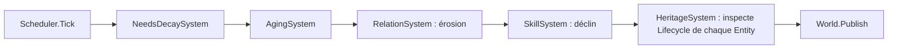

# ENGINE-008 — Systems de population (Relations, Compétences, Héritage)

> Version : 1.3
> Statut : Validée
> Maturité : 3
> Bibliothèque : ENGINE

⸻

# 1. Objectif

Traduire GDB-004C (Les Relations Sociales), GDB-004H (Les Compétences) et
GDB-004J (La Transmission) en architecture concrète --- types, Systems,
formules --- prête à être implémentée dans `CHRONIQUES-ENGINE`.

Ce document précède tout code (Maturité 2, Spécification --- MASTER-007),
conformément à ENGINE-000, section 3. Il correspond à la cible « relations,
mémoire, compétences, héritage minimal » de PROD/FeuilleDeRoute.md pour
v0.3, qui atteint le critère de sortie de la Phase 1 de MASTER-005.

Ce document ne redéfinit aucun concept déjà posé par la GDB. Chaque
type ci-dessous porte le nom de son concept GDB d'origine et cite la
section qu'il implémente, jamais une règle nouvelle.

---

# 2. Principe

Toute la logique vit dans les Systems, jamais dans les Components qu'ils
font évoluer (CORE-003-C) --- même principe qu'ENGINE-004.

Les paramètres numériques (taux d'érosion, seuils, capacités) sont des
paramètres de constructeur, jamais des constantes internes ---
directement exigé par GDB-004C et GDB-004H eux-mêmes (section
« Paramètres d'implémentation » des deux documents), et cohérent avec
NeedsDecaySystem/AgingSystem (ENGINE-004).

---

# 3. Responsabilités

## RelationComponent / RelationSystem

Implémente GDB-004C. `RelationComponent` porte la liste des relations
actives d'un habitant. `RelationSystem` est responsable de :

- l'érosion naturelle de la Force de chaque relation à chaque Tick, avec
  un plancher non nul pour les relations de type Familiale (GDB-004C,
  ÉVOLUTION) ;
- l'enregistrement d'une interaction qualifiante --- création de la
  relation si elle n'existe pas encore, application de l'effet
  d'interaction, création d'un Épisode si l'ampleur franchit le seuil
  d'importance, éviction du plus ancien Épisode au-delà de la capacité
  (GDB-004C, ÉPISODES) ;
- la suppression d'une relation dont la Force atteint 0 (sauf plancher
  familial).

N'est jamais responsable de la Réputation (GDB-004I) --- différée à
MASTER-005 Phase 3 (GDB-004C, FRONTIÈRE AVEC GDB-004I).

## SkillComponent / SkillSystem

Implémente GDB-004H. `SkillComponent` porte les Compétences d'un
habitant, chacune identifiée par son nom. `SkillSystem` est responsable
de :

- le déclin du Niveau d'une Compétence non pratiquée au-delà d'un seuil
  d'inactivité (GDB-004H, MODÈLE DE PROGRESSION) ;
- l'enregistrement d'une pratique qualifiante --- gain de Niveau
  décroissant à mesure que le Niveau approche 100.

## HeritageSystem

Implémente GDB-004J. Ne porte aucun Component propre --- il consomme
`RelationComponent` (pour désigner l'héritier) et détecte la mort d'une
Entity en inspectant directement son `Lifecycle` (si
`CurrentState.Name == "mort"` et que l'Entity n'a pas encore été traitée
pour l'héritage). Il ne lit jamais `World.Events` pour détecter un
`vie.mort` --- `World.Events` reste un journal d'observabilité
(ENGINE-001 v2.0), jamais un canal de coordination entre Systems.
Responsable de :

- désigner l'héritier selon le modèle déterministe de GDB-004J
  (priorité Familiale, puis Force la plus élevée, tie-break par
  ancienneté) ;
- appliquer l'un des trois cas d'échec (absence de successeur, refus,
  transmission incomplète) lorsque la désignation ou la transmission
  n'aboutit pas normalement --- jamais une disparition silencieuse
  (GDB-004J, invariant commun) ;
- publier un `GameEvent` observable pour toute transmission, réussie ou
  non --- ce `GameEvent` est produit pour l'observabilité, pas pour
  déclencher un autre System.

---

# 4. Architecture

## 4.1 Relations

```csharp
public enum TypeRelation
{
    Familiale, Amicale, Professionnelle, Commerciale,
    Politique, Conflictuelle, Sentimentale
}

public sealed record Episode(Tick Tick, string Description, double Impact);

public sealed class Relation
{
    public EntityId Cible { get; }
    public TypeRelation Type { get; }
    public double Force { get; internal set; }
    public Tick CreeeAu { get; }
    public IReadOnlyList<Episode> Episodes { get; }
}

public sealed class RelationComponent : IComponent
{
    public IReadOnlyList<Relation> Relations { get; }
}
```

`RelationSystem` porte les paramètres de constructeur : taux d'érosion
par Tick, plancher familial, seuil d'importance d'un Épisode, capacité
maximale d'Épisodes, Force initiale d'une nouvelle relation --- toutes
volontairement non fixées par GDB-004C (voir section 2).

**Cas limite verrouillé — plancher familial :** une relation Familiale
dont la Force est au plancher ne peut pas descendre en dessous par la
seule érosion naturelle. Un effet d'interaction négatif d'amplitude
suffisante peut l'y amener. Si la Force franchit 0 par interaction
négative, la relation disparaît --- il n'y a pas d'immunité absolue,
seulement une immunité à l'érosion seule (cohérent avec GDB-009C :
le lien du sang s'affaiblit, il ne s'efface jamais par le seul temps,
mais peut se rompre par un acte délibéré).

## 4.2 Compétences

```csharp
public sealed class Competence
{
    public double Niveau { get; internal set; }
    public Tick DernierePratique { get; internal set; }
}

public sealed class SkillComponent : IComponent
{
    public IReadOnlyDictionary<string, Competence> Competences { get; }
}
```

`SkillSystem` porte : facteur de gain par pratique, seuil d'inactivité,
taux de déclin par Tick inactif --- non fixés par GDB-004H.

**Cas limite verrouillé — décroissance du gain :** le gain d'une
pratique est une fonction strictement décroissante du Niveau courant.
À Niveau 0, le gain est maximal (valeur du facteur de gain en
paramètre) ; à Niveau 100, le gain est nul ou infinitésimal. La forme
exacte de cette décroissance (linéaire, exponentielle inverse, etc.)
est un paramètre d'implémentation, mais le comportement qualitatif est
fixé : chaque point de Niveau supplémentaire rend la progression
marginalement plus difficile que le précédent, jamais plus facile.

## 4.3 Héritage

`HeritageSystem` ne définit aucun type propre --- il opère sur
`RelationComponent` et sur le `Lifecycle` déjà défini par le Kernel
(ENGINE-002). Le résultat d'une transmission (patrimoine redistribué,
Compétence perdue ou reconstruite --- GDB-004J, CAS D'ÉCHEC) reste hors
périmètre de ce document tant que le patrimoine matériel lui-même n'a
pas de représentation dans le Kernel --- ne pas anticiper (MASTER-006).
Ce que ce document fixe est uniquement la désignation de l'héritier et
la production d'un événement observable pour chacun des trois cas
d'échec.

**Cas limite verrouillé — refus de l'héritier :** GDB-004J (CAS
D'ÉCHEC, « Refus du successeur ») dit que l'héritier peut rejeter
l'héritage en tout ou partie. Ce document fixe le mécanisme déclencheur
sans anticiper le patrimoine matériel : le refus est déclenché par un
Intent de l'héritier (via le pipeline d'Actions, ENGINE-006) qui
produit un Effect de type `HeritageRefusalEffect`. `HeritageSystem`
traite cet Effect en appliquant le même chemin que l'absence de
successeur pour la part refusée. L'Intent lui-même est créé par le
modèle comportemental de l'héritier --- hors périmètre de ce document,
relevant de la psychologie des habitants (Phase 3, MASTER-005). En
Phase 1, le refus peut être déclenché manuellement par le joueur si
son personnage est l'héritier désigné.

---

# 5. Flux



L'ordre place `HeritageSystem` après `AgingSystem` dans l'enregistrement
Scheduler --- condition nécessaire pour que le `Lifecycle` d'une Entity
décédée ce même Tick soit déjà à l'état `"mort"` quand
`HeritageSystem.Update` s'exécute.

En dehors du Tick, un second flux existe, indépendant du Scheduler :
l'application des Effects d'une Action Instance résolue (ENGINE-006,
section 5) passe par un mécanisme de résolution d'Effects (voir section
5.1 ci-dessous) --- le pipeline ne connaît jamais les Systems concrets,
il produit des Effects typés qu'un résolveur dispatche vers le
composant responsable.

## 5.1 Résolution des Effects

Le pipeline d'Actions (ENGINE-006) produit des Effects (données) à la
résolution d'une Action Instance. Il ne sait pas quel System les
traitera --- il ne dépend d'aucun System concret.

La traduction d'un Effect en mutation du World passe par un résolveur
(`EffectApplicator` ou équivalent), qui dispatche chaque Effect typé
vers le composant responsable :

```text
Action Instance
↓
Execution Engine
↓
Effects (données typées)
↓
EffectApplicator / Resolver
↓
World mutation via le service métier dédié
```

Exemples d'Effects typés introduits par ce document :

- `RelationInteractionEffect` --- dispatché vers `RelationSystem`, qui
  applique l'effet d'interaction et crée éventuellement un Épisode
  (GDB-004C) ;
- `SkillPracticeEffect` --- dispatché vers `SkillSystem`, qui applique
  le gain de Niveau (GDB-004H).

Ce mécanisme préserve deux séparations fondamentales :

1. **ENGINE-006 ne connaît pas ENGINE-008.** Le pipeline produit des
   Effects, jamais des appels directs à des Systems concrets. Ajouter un
   nouveau type d'Effect ne modifie pas ENGINE-006.
2. **Le flux temporel (Update) reste distinct du flux déclenché par une
   Action.** `RelationSystem.Update` fait l'érosion naturelle ;
   `RelationSystem` traite un `RelationInteractionEffect` quand le
   résolveur le lui dispatche --- deux chemins d'entrée, une seule
   source de vérité sur l'état de la relation.

Le résolveur lui-même est un composant d'infrastructure dont la
spécification complète dépend d'ENGINE-006 --- ce document ne le définit
pas en détail, seulement les types d'Effects qu'ENGINE-008 introduit et
les Systems qui en sont responsables. Si ENGINE-006 ne prévoit pas
encore ce résolveur, c'est un enrichissement à y apporter au moment de
l'implémentation, pas une anticipation (le besoin est concret dès
qu'ENGINE-008 est implémenté).

---

# 6. Contrat

## RelationSystem

- La Force reste toujours bornée entre 0 et 100.
- Une relation Familiale ne descend jamais sous son plancher par la
  seule érosion --- seul un effet d'interaction négatif suffisamment
  fort peut l'y amener.
- Un Épisode n'est créé que si l'ampleur de l'interaction franchit le
  seuil d'importance --- jamais pour une interaction ordinaire.
- Au-delà de la capacité, le plus ancien Épisode est retiré en
  priorité, jamais le plus marquant.

## SkillSystem

- Le Niveau reste toujours borné entre 0 et 100.
- Le gain d'une pratique décroît strictement à mesure que le Niveau
  approche 100.
- Le déclin ne s'applique qu'après le seuil d'inactivité, jamais avant.

## HeritageSystem

- Une Entity morte déjà traitée par `HeritageSystem` n'est jamais
  retraitée --- chaque transmission n'est déclenchée qu'une seule fois
  pour une même Entity.
- La désignation de l'héritier suit exactement l'algorithme de GDB-004J
  --- aucune Entity ne peut être désignée héritière par un autre chemin.
- L'un des trois cas d'échec de GDB-004J s'applique systématiquement
  quand la désignation ou la transmission n'aboutit pas normalement ---
  jamais de sortie silencieuse.

---

# 7. Invariants

- Un Component absent n'est jamais une erreur pour le System qui le
  cherche --- l'Entity est ignorée, silencieusement (même invariant
  qu'ENGINE-004).
- `HeritageSystem` ne modifie jamais directement `RelationComponent` ---
  il le lit pour désigner l'héritier, seul `RelationSystem` le modifie.
- Aucun des trois Systems ne publie d'événement sans qu'un changement
  d'état réel se soit produit.
- Aucun System ne lit `World.Events` pour décider d'agir ---
  `World.Events` reste un journal d'observabilité (ENGINE-001), jamais
  un canal de coordination entre Systems. `HeritageSystem` détecte la
  mort par inspection directe du `Lifecycle`.
- Le pipeline d'Actions (ENGINE-006) ne connaît aucun System concret
  d'ENGINE-008. Les mutations déclenchées par une Action passent par
  des Effects typés et un résolveur (section 5.1), jamais par un appel
  direct du pipeline vers `RelationSystem` ou `SkillSystem`.

---

# 8. Validation

✓ `RelationSystemTests` --- érosion, plancher familial, création,
  disparition à Force 0, création d'Épisode au-dessus du seuil, absence
  d'Épisode en dessous, éviction du plus ancien au-delà de la capacité,
  traitement correct d'un `RelationInteractionEffect` dispatché par le
  résolveur ;

✓ `SkillSystemTests` --- gain décroissant en approchant 100, absence de
  déclin avant le seuil d'inactivité, déclin après, traitement correct
  d'un `SkillPracticeEffect` dispatché par le résolveur ;

✓ `HeritageSystemTests` --- désignation priorisant Familiale, tie-break
  par ancienneté, absence de successeur, refus, transmission
  incomplète, détection de la mort par inspection du Lifecycle (jamais
  par lecture de `World.Events`), non-retraitement d'une Entity déjà
  traitée pour l'héritage.

---

# 9. Historique

## Version 1.3

- Corrigé l'en-tête (Version 1.0 → 1.2, erreur de copie persistante
  depuis la création du document).
- Corrigé le contrat `HeritageSystem` : « au Tick où l'événement est
  publié » supprimé --- la détection repose désormais exclusivement sur
  l'inspection du `Lifecycle`, plus sur `vie.mort`. Formulé comme
  « une Entity morte déjà traitée n'est jamais retraitée », sans
  référence à un journal d'événements.
- Ajouté trois cas limites verrouillés, identifiés par revue externe
  comme insuffisamment précis avant implémentation :
  1. Plancher familial : la Force d'une relation Familiale est immune
     à la seule érosion, pas à un effet d'interaction négatif suffisant.
     Une relation Familiale peut donc disparaître par acte délibéré,
     pas par le seul écoulement du temps (cohérent avec GDB-009C).
  2. Décroissance du gain de Compétence : strictement décroissante en
     fonction du Niveau, sans préciser la forme exacte (paramètre
     d'implémentation), mais en fixant le comportement qualitatif.
  3. Mécanisme du refus d'héritage : déclenché par un
     `HeritageRefusalEffect` produit par un Intent de l'héritier
     (pipeline ENGINE-006). En Phase 1, déclenché manuellement par le
     joueur si son personnage est l'héritier désigné.
- Statut : **Proposition → Validée**, Maturité 2 → 3, sur verdict de
  revue externe (« ENGINE-008 est maintenant architecturalement sain »).

## Version 1.2

- Corrigé deux erreurs d'architecture introduites en v1.0-v1.1, toutes
  deux identifiées par revue externe :
  1. `HeritageSystem` détecte désormais la mort par inspection directe
     du `Lifecycle` de chaque Entity, plus par lecture de `World.Events`
     --- `World.Events` reste un journal d'observabilité (ENGINE-001),
     jamais un canal de coordination entre Systems.
  2. Le pipeline d'Actions ne connaît plus aucun System concret
     d'ENGINE-008. Les mutations déclenchées par une Action passent par
     des Effects typés (`RelationInteractionEffect`,
     `SkillPracticeEffect`) et un résolveur (`EffectApplicator`,
     section 5.1), jamais par un appel direct du pipeline vers
     `RelationSystem` ou `SkillSystem`. Cette architecture préserve la
     séparation entre flux temporel (`Update`) et mutation déclenchée
     par une Action, sans coupler ENGINE-006 aux Systems.
- Tests de validation enrichis en conséquence.

## Version 1.1

- Corrigé le mécanisme de détection des événements `vie.mort` par
  `HeritageSystem` : traitement dans son propre `Update`, après
  `AgingSystem` dans l'ordre du Scheduler, pas via un bus de réaction
  --- la proposition initiale était juste sur ce point, c'est sa
  première rédaction en v1.0 qui avait introduit l'erreur.
- Ajouté le flux Effects → `RelationSystem.EnregistrerInteraction` /
  `SkillSystem.Pratiquer`, distinct de la boucle de Tick --- autre
  correction d'une hypothèse erronée en v1.0, le code réel a bien
  besoin de ces deux chemins d'invocation.
- Précisé qu'`HeritageSystem` ne retraite jamais un `vie.mort` survenu
  à un Tick antérieur --- même engagement que `GameEventTests` vérifie
  déjà pour le journal d'événements dans `AgingSystemTests`.

## Version 1.0

- Création du document. Traduit GDB-004C, GDB-004H et GDB-004J en
  architecture concrète --- types, Systems, formules --- prête à guider
  l'implémentation dans `CHRONIQUES-ENGINE`. Statut Proposition,
  Maturité 2 (Spécification) : précède toute implémentation,
  conformément à ENGINE-000, section 3.
