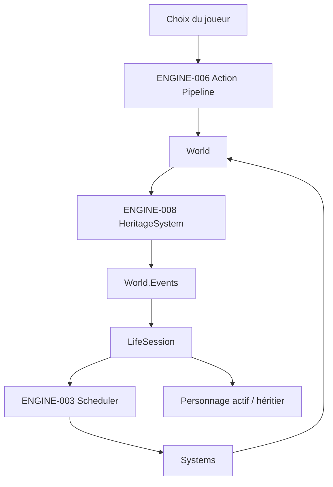

# ENGINE-009 — Boucle de vie minimale

> Version : 1.1
> Statut : Validée
> Maturité : 4
> Bibliothèque : ENGINE
> Dépendances : ENGINE-001, ENGINE-003, ENGINE-006, ENGINE-008, PROD/FeuilleDeRoute.md v2.3

---

# 1. Objectif

Définir l'orchestration minimale permettant à Chroniques de relier les briques déjà implémentées de la v0.3 en un parcours continu :

```text
personnage actif
↓
choix du joueur
↓
Action Pipeline
↓
évolution du World
↓
vieillissement
↓
mort
↓
héritage minimal
↓
continuité avec l'héritier
```

ENGINE-009 n'ajoute aucune nouvelle règle métier de vie, de relations, de compétences ou d'héritage.

Il définit uniquement la responsabilité d'orchestration qui manque entre :

- le Scheduler et la boucle temporelle (ENGINE-003) ;
- le pipeline d'Actions joueur (ENGINE-006) ;
- les Systems de population et l'héritage minimal (ENGINE-008) ;
- le critère de sortie v0.3 de la feuille de route : vivre une vie complète, mourir et poursuivre avec son héritier.

---

# 2. Principe

La boucle de vie minimale est une couche d'orchestration extérieure aux Systems métier.

Elle ne devient jamais :

- un nouveau System de simulation ;
- un EventBus ;
- un moteur de règles métier ;
- un Planner ;
- un Execution Engine ;
- un remplaçant du Scheduler.

Elle relie des composants déjà responsables de leurs domaines respectifs.

```text
ENGINE-009
= orchestration
≠ logique métier
```

---

# 3. Responsabilités

La boucle de vie minimale est responsable de :

- connaître l'Entity actuellement contrôlée par le joueur ;
- exposer l'état courant de la session de vie ;
- demander au Scheduler de faire avancer le World lorsque l'application décide que le temps doit progresser ;
- constater après un Tick si le personnage actif est toujours vivant ;
- constater la transmission produite par ENGINE-008 lorsque le personnage actif meurt ;
- transférer le contrôle vers l'héritier désigné lorsqu'une transmission valide existe ;
- terminer la session lorsqu'aucune continuité n'est possible.

Elle n'est pas responsable de :

- choisir automatiquement les Actions du joueur ;
- exécuter les Actions à la place d'ENGINE-006 ;
- modifier directement les Components métier ;
- désigner elle-même un héritier ;
- faire agir automatiquement les PNJ ;
- distribuer les GameEvent aux Systems.

---

# 4. Position architecturale



La lecture de `World.Events` par la couche de session est autorisée par ENGINE-001 : le journal est lisible depuis l'extérieur du World pour l'observabilité.

Cette lecture ne constitue pas une communication entre Systems.

---

# 5. LifeSession

La structure minimale proposée est :

```csharp
public enum LifeSessionState
{
    Active,
    EndedWithoutSuccessor
}

public sealed class LifeSession
{
    public World World { get; }

    public EntityId ActiveCharacterId { get; private set; }

    public LifeSessionState State { get; private set; }

    public void AdvanceTime();
}
```

Le nom exact peut évoluer pendant l'implémentation si la responsabilité reste identique.

`LifeSession` ne doit porter aucune règle métier qui appartient déjà aux documents GDB, ACT ou aux Systems.

---

# 6. Avancement du temps

`AdvanceTime()` orchestre exactement un appel au Scheduler :

```text
LifeSession.AdvanceTime
↓
Scheduler.Tick(World)
↓
World.Advance
↓
Systems.Update dans l'ordre enregistré
↓
Synchronisation de la session
```

ENGINE-009 ne déclare pas qu'une Action joueur vaut automatiquement un Tick.

La décision de faire avancer le temps après une Action appartient à la couche applicative et aux contrats temporels qui seront réellement nécessaires.

Cette séparation évite d'introduire prématurément la règle :

```text
1 Action = 1 Tick
```

qui n'est pas définie par les documents d'autorité actuels.

---

# 7. Actions du joueur

ENGINE-009 ne déclenche aucune Action automatiquement à chaque Tick.

En Phase 1, les Actions restent déclenchées par un choix du joueur et traversent ENGINE-006 :

```text
Intent
↓
Planner
↓
Plan
↓
Action Instance
↓
Execution Engine
↓
Outcome
↓
Effects
↓
World
```

La boucle de vie ne remplace ni `PipelineRunner`, ni un futur mécanisme plus général d'exécution des Actions.

La généralisation de `PipelineRunner` au-delà du Verbe de démonstration « Se reposer » reste un besoin distinct qui ne doit être traité que lorsqu'un besoin réel supplémentaire le justifie.

---

# 8. Détection de la mort du personnage actif

Après chaque Tick, `LifeSession` inspecte l'état réel du personnage actif.

```text
ActiveCharacter
↓
Lifecycle.CurrentState.Name == "mort" ?
```

Si non :

```text
session reste Active
```

Si oui :

```text
chercher la continuité produite par HeritageSystem
```

La session ne déduit jamais la mort uniquement depuis un `vie.mort`.

Le `Lifecycle` reste la source de vérité de l'état de vie.

---

# 9. Passage à l'héritier

`HeritageSystem` reste l'unique responsable de la désignation de l'héritier.

La session ne reproduit jamais son algorithme.

Après le Tick ayant provoqué la mort du personnage actif, la session peut consulter les `GameEvent` observables du Tick courant afin de récupérer le résultat déjà produit par ENGINE-008.

Cas de continuité :

```text
heritage.transmission
source = personnage actif décédé
target = héritier
```

Si la cible existe dans le World :

```text
ActiveCharacterId = target
State = Active
```

La session ne crée aucune nouvelle Entity et ne modifie aucune relation.

---

# 10. Absence de successeur

Si le personnage actif est mort et que ENGINE-008 produit :

```text
heritage.absence-successeur
```

sans `heritage.transmission` valide pour ce décès, alors :

```text
State = EndedWithoutSuccessor
```

La session est terminée.

ENGINE-009 ne définit pas de Game Over narratif, d'écran, de récompense ou de nouvelle règle de succession.

---

# 11. Refus d'héritage

Le refus d'héritage reste traité par :

```text
HeritageRefusalEffect
↓
PopulationEffectApplicator
↓
HeritageSystem.RefuserHeritage
```

ENGINE-009 ne redéfinit pas ce flux.

Dans l'état actuel du moteur, le refus concerne l'héritage et non la propriété du contrôle joueur sur l'Entity devenue héritière.

Toute règle future modifiant la continuité de session en cas de refus devra être définie d'abord par la GDB puis traduite dans ENGINE.

---

# 12. World.Events

ENGINE-009 respecte ENGINE-001.

`World.Events` reste :

```text
journal d'observabilité
```

et jamais :

```text
EventBus entre Systems
```

La couche de session peut lire les événements déjà publiés pour comprendre le résultat d'un Tick, de la même manière qu'un test, un outil ou un futur Rendering peut les inspecter.

Aucun System n'est déclenché par cette lecture.

---

# 13. Ordre des Systems

La boucle de vie dépend de l'ordre déterministe du Scheduler.

Pour le parcours de mort et transmission, l'invariant minimal reste :

```text
AgingSystem
↓
HeritageSystem
```

Ainsi :

```text
AgingSystem
→ Lifecycle = mort

puis

HeritageSystem
→ constate Lifecycle
→ publie le résultat de transmission
```

`LifeSession` synchronise le personnage actif uniquement après la fin complète de `Scheduler.Tick`.

---

# 14. Invariants

- Un seul `ActiveCharacterId` existe par `LifeSession` active.
- `LifeSession` ne modifie jamais directement un Component métier.
- `LifeSession` ne désigne jamais elle-même un héritier.
- `LifeSession` ne lit pas `World.Events` pour faire agir un System.
- `LifeSession` ne déclenche aucune Action joueur automatiquement à chaque Tick.
- `Scheduler` reste l'unique responsable de l'ordre des Systems et de l'avancement d'un Tick.
- `Lifecycle` reste la source de vérité pour savoir si le personnage actif est mort.
- `HeritageSystem` reste la source de vérité pour la désignation de l'héritier.
- Une transmission de contrôle ne peut viser qu'une Entity existante du World.
- Une session sans successeur valide devient terminale.

---

# 15. Frontière avec ENGINE-C06

ENGINE-009 ne ferme pas le constat historique `ENGINE-C06` relatif à une éventuelle orchestration automatique des Actions de PNJ avec le Scheduler.

Cette question concerne la phase du monde vivant et les habitants autonomes.

ENGINE-009 couvre uniquement la Phase 1 :

```text
Actions déclenchées par le joueur
+
progression temporelle explicite
+
continuité du personnage contrôlé
```

Il n'introduit donc aucun moteur d'autonomie des habitants.

---

# 16. Contrat TECH

L'implémentation devra permettre au minimum de :

- créer une session avec un World et un personnage actif existant ;
- faire avancer le World via le Scheduler sans dupliquer sa logique ;
- conserver le même personnage actif tant qu'il est vivant ;
- constater sa mort via `Lifecycle` ;
- basculer vers la cible d'un `heritage.transmission` valide produit pour ce personnage ;
- terminer proprement la session si aucun successeur n'existe ;
- rester déterministe à World, ordre des Systems et entrées identiques.

---

# 17. Contrat QA

Les tests devront vérifier au minimum :

✓ `AdvanceTime()` appelle exactement une progression de Tick ;

✓ un personnage vivant reste le personnage actif ;

✓ une mort sans successeur termine la session ;

✓ une mort avec transmission valide transfère le contrôle à l'héritier ;

✓ la session ne reproduit pas l'algorithme de sélection de `HeritageSystem` ;

✓ un événement de transmission ancien ne peut pas être réutilisé pour une mort ultérieure ;

✓ une cible de transmission inexistante ne devient jamais le personnage actif ;

✓ aucun appel à `LifeSession` ne fait exécuter automatiquement une Action de PNJ ;

✓ à état et entrées identiques, la séquence de personnages actifs est identique.

---

# 18. Test d'intégration cible v0.3

Le test d'intégration de référence doit démontrer le parcours minimal suivant :

```text
World créé
↓
Personnage A actif
↓
au moins un choix joueur traverse ENGINE-006
↓
le temps progresse via Scheduler
↓
Personnage A vieillit
↓
Personnage A meurt
↓
HeritageSystem désigne B
↓
heritage.transmission(A → B)
↓
LifeSession bascule sur B
↓
la session reste Active
```

Ce test ne prétend pas à lui seul prouver toute la richesse d'une vie complète.

Il prouve la continuité architecturale minimale exigée pour relier les briques de la v0.3.

---

# 19. Critères de validation

ENGINE-009 peut passer à Maturité 4 lorsque :

- l'implémentation correspond identifiant pour identifiant au contrat retenu ;
- les tests unitaires de session sont passants ;
- un test d'intégration démontre réellement le passage :

```text
personnage actif
→ mort
→ héritier
→ continuité
```

- aucun System n'est couplé à `World.Events` ;
- aucune nouvelle règle métier n'est introduite par la couche d'orchestration.

## État de validation

Ces critères ont été validés le 11 août 2026.

```text
dotnet build
→ succès

dotnet test
→ 134 / 134 tests réussis
→ 0 échec
```

La couverture comprend les tests unitaires de `LifeSession`, les invariants QA du présent document et le test d'intégration v0.3 :

```text
Action joueur
→ progression temporelle
→ vieillissement
→ mort
→ HeritageSystem
→ transmission
→ bascule du contrôle vers l'héritier
```

ENGINE-009 est donc **Validée / Maturité 4**.

---

# 20. Hors périmètre

ENGINE-009 ne définit pas :

- les PNJ autonomes ;
- la Mémoire du Monde ;
- les croyances ;
- les émotions ;
- la perception ;
- le patrimoine matériel complet ;
- la transmission matérielle complète ;
- le Rendering Godot ;
- le catalogue final des Verbes ;
- l'équivalence entre Action et durée temporelle ;
- une IA de décision.

Ces sujets restent attachés à leurs phases et bibliothèques d'autorité respectives.

---

# 21. Historique

## Version 1.1

- ENGINE-009 passe à **Validée / Maturité 4** ;
- implémentation `LifeSession` confirmée dans `CHRONIQUES-ENGINE` ;
- contrat QA complété et validé ;
- test d'intégration v0.3 confirmé ;
- validation technique portée à **134 / 134 tests réussis**.

## Version 1.0

- création d'ENGINE-009 comme spécification préalable à l'orchestration de la boucle de vie minimale ;
- séparation explicite entre Actions joueur et progression du Scheduler ;
- absence volontaire de règle `1 Action = 1 Tick` ;
- continuité joueur définie par `Lifecycle` + résultat observable de `HeritageSystem` ;
- `World.Events` conservé comme journal d'observabilité, jamais comme canal entre Systems ;
- distinction explicite avec ENGINE-C06 et l'autonomie future des PNJ ;
- objectif de validation : démontrer `personnage actif → mort → héritier → continuité`.
