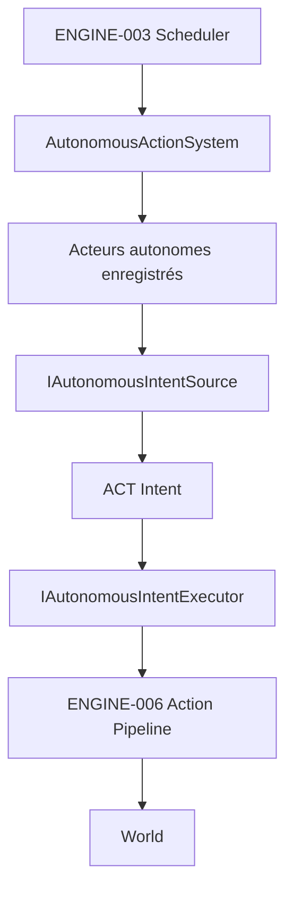

# ENGINE-010 — Orchestration des habitants autonomes

> Version : 1.0
> Statut : Proposition
> Maturité : 2
> Bibliothèque : ENGINE
> Dépendances : MASTER-005, GDB-004A, GDB-004B, ACT-002-H, ACT-004-A, ENGINE-003, ENGINE-006, ENGINE-009

---

# 1. Objectif

Définir le premier mécanisme architectural de la Phase 3 de `MASTER-005 — Le monde vivant` : permettre à un habitant explicitement considéré comme autonome d'initier une Action sans intervention du joueur, tout en réutilisant le pipeline d'Actions existant.

Le parcours minimal recherché est :

```text
Scheduler.Tick
↓
AutonomousActionSystem
↓
acteur autonome enregistré
↓
source déterministe d'Intent
↓
Intent éventuel
↓
exécuteur d'Intent injecté
↓
ENGINE-006 Action Pipeline
↓
Outcome / Effects
↓
World
```

ENGINE-010 répond au besoin architectural conservé par le constat `ENGINE-C06` : à l'entrée dans la phase des habitants autonomes, le Scheduler doit désormais pouvoir conduire indirectement des Actions sans que le joueur les déclenche.

---

# 2. Autorités amont

## MASTER-005

La Phase 3 exige notamment :

```text
Habitants autonomes qui vieillissent, travaillent et meurent
```

et un monde capable d'évoluer sans intervention permanente du joueur.

## GDB-004A

Les habitants poursuivent leur existence même lorsque le joueur n'interagit pas avec eux.

Ils peuvent notamment travailler, se déplacer, échanger, apprendre et vieillir.

## GDB-004B

Les besoins constituent l'un des moteurs principaux de leurs décisions.

Chaque habitant agit pour satisfaire des besoins et établit des priorités selon sa situation.

## ACT

Une Action ne naît jamais spontanément : elle provient d'un `Intent` porté par un Acteur.

ENGINE-010 ne contourne donc jamais :

```text
Acteur
↓
Intent
↓
Plan
↓
Action
↓
Outcome
```

---

# 3. Ce que ENGINE-010 résout

ENGINE-010 résout uniquement l'orchestration automatique entre :

- le Tick déterministe d'ENGINE-003 ;
- un habitant autorisé à agir de manière autonome ;
- une source d'Intent ;
- le mécanisme d'exécution conforme à ENGINE-006.

Il fournit le point de raccordement qui manquait jusque-là entre :

```text
Scheduler
```

et :

```text
Action Pipeline
```

pour les habitants autonomes.

---

# 4. Ce que ENGINE-010 ne résout pas

ENGINE-010 ne définit pas :

- une intelligence artificielle complète ;
- une psychologie ;
- des émotions ;
- des croyances ;
- une mémoire individuelle ;
- la Mémoire du Monde ;
- un système d'ambitions complet ;
- un système d'habitudes complet ;
- un catalogue de Verbes ;
- un système de métiers ;
- une économie autonome ;
- une règle `1 Action = 1 Tick` ;
- une formule universelle de sélection d'Action ;
- un seuil métier imposant qu'un besoin précis déclenche automatiquement une Action précise.

Ces éléments doivent rester dans leurs bibliothèques et phases d'autorité respectives.

---

# 5. Principe de séparation

La couche d'orchestration ne décide jamais elle-même de ce qu'un habitant veut faire.

```text
AutonomousActionSystem
= quand demander et quand transmettre
≠ pourquoi choisir cette Action
```

Le choix de l'objectif est délégué à une source d'Intent injectée.

L'exécution est déléguée à un exécuteur d'Intent injecté.

Ainsi :

```text
orchestration
≠ décision métier
≠ exécution métier
```

---

# 6. Position architecturale



`AutonomousActionSystem` est un `ISystem` ordinaire.

Il est donc exécuté dans l'ordre d'enregistrement du Scheduler, comme tous les autres Systems.

---

# 7. Acteurs autonomes

ENGINE-010 n'affirme pas que toute Entity du World est automatiquement autonome.

Un habitant doit être explicitement enregistré auprès du système d'autonomie.

Structure minimale proposée :

```csharp
public sealed class AutonomousActionSystem : ISystem
{
    public IReadOnlyList<EntityId> Actors { get; }

    public void RegisterActor(EntityId actorId);

    public void Update(World world, Tick currentTick);
}
```

L'ordre d'enregistrement est conservé.

Cet ordre devient une partie du comportement déterministe lorsque plusieurs habitants autonomes agissent pendant le même Tick.

ENGINE-010 ne crée pas encore de `NpcComponent`, `AutonomyComponent` ou autre marqueur métier tant qu'aucune autorité amont n'en exige un.

---

# 8. Éligibilité d'un Acteur

Avant toute demande d'Intent, le système vérifie au minimum :

```text
Entity existe dans World
+
Lifecycle != mort
```

Une Entity absente est ignorée.

Une Entity morte est ignorée.

Cette vérification ne remplace pas les règles d'éligibilité d'ACT-004-A ni les Preconditions propres aux Actions.

Elle évite uniquement de demander une décision autonome à une Entity qui n'est manifestement plus capable d'agir dans l'état actuel du moteur.

---

# 9. Source d'Intent autonome

La responsabilité de proposer un objectif appartient à :

```csharp
public interface IAutonomousIntentSource
{
    Intent? CreateIntent(
        Entity actor,
        World world,
        Tick currentTick);
}
```

Le nom exact peut évoluer pendant l'implémentation si la responsabilité reste identique.

La source :

- reçoit l'Acteur réellement présent dans le World ;
- peut observer l'état nécessaire à sa décision ;
- retourne soit un `Intent`, soit `null` ;
- ne modifie jamais directement le World ;
- ne crée jamais d'Action Instance ;
- ne produit jamais directement d'Effect ;
- ne publie jamais directement d'Event ;
- doit être déterministe à état, seed, Tick et entrées identiques.

---

# 10. Absence d'Intent

Une source peut retourner :

```text
null
```

Cela signifie uniquement :

```text
aucun nouvel Intent autonome à initier lors de cette invocation
```

Cela ne signifie pas :

- que l'habitant est inactif narrativement ;
- qu'il n'a aucun besoin ;
- qu'il ne pourra jamais agir ;
- que son temps s'arrête.

Le Scheduler et les autres Systems continuent normalement.

---

# 11. Cohérence de l'Acteur

Si la source retourne un `Intent`, son `Acteur` doit être l'Entity pour laquelle la décision a été demandée.

Invariant :

```text
intent.Acteur == actor.Id
```

Une source d'Intent autonome ne peut jamais faire agir silencieusement une autre Entity.

Une violation de cet invariant constitue une erreur d'intégration et doit être rejetée explicitement par l'orchestration.

---

# 12. Exécution de l'Intent

ENGINE-010 introduit une frontière d'exécution minimale :

```csharp
public interface IAutonomousIntentExecutor
{
    void Execute(Intent intent, World world);
}
```

Cette interface n'est pas un second Action Pipeline.

Elle représente uniquement le point de raccordement par lequel l'orchestration autonome remet un `Intent` à un exécuteur conforme à ENGINE-006.

Une implémentation ou un adaptateur peut utiliser `PipelineRunner` ou tout futur exécuteur général conforme à ENGINE-006.

`AutonomousActionSystem` ne connaît :

- ni `SimplePlanner` ;
- ni `SimpleExecutionEngine` ;
- ni `SeReposerDefinition` ;
- ni `PopulationEffectApplicator` ;
- ni aucun Verbe concret.

---

# 13. Frontière avec PipelineRunner

Le moteur possède actuellement un `PipelineRunner` spécialisé sur le Verbe de démonstration « Se reposer ».

ENGINE-010 ne transforme pas artificiellement ce prototype en interprète universel.

Le besoin réel ouvert par la Phase 3 justifie désormais une frontière générique entre :

```text
orchestration autonome
```

et :

```text
exécution d'un Intent
```

mais pas encore la création d'un catalogue universel de dispatch des Verbes.

Un test d'intégration peut utiliser un adaptateur vers le `PipelineRunner` actuel afin de prouver le raccordement réel avec ENGINE-006 sans prétendre résoudre tous les futurs Verbes.

---

# 14. Exécution pendant un Tick

Lors de `Update` :

```text
pour chaque acteur enregistré
↓
vérifier existence
↓
vérifier état de vie minimal
↓
demander un Intent à la source
↓
aucun Intent ? continuer
↓
vérifier intent.Acteur
↓
transmettre à l'exécuteur
```

Le System ne fait jamais avancer lui-même le Tick.

Il agit uniquement parce que le Scheduler l'a invoqué.

---

# 15. Nombre d'Intents par invocation

Dans cette première version, une invocation de la source retourne au maximum un `Intent` par Acteur et par `Update`.

Cette limitation est une borne d'orchestration minimale, pas une règle de Game Design équivalente à :

```text
1 habitant = 1 Action par Tick
```

ENGINE-010 ne définit aucune équivalence entre durée d'Action et Tick.

Si de futurs contrats temporels nécessitent plusieurs Intents, des files d'attente, des Actions persistantes ou une fréquence différente, cette architecture pourra évoluer après spécification amont.

---

# 16. Ordre déterministe

Les habitants sont évalués dans leur ordre d'enregistrement.

Exemple :

```text
A enregistré
B enregistré
C enregistré

Tick
↓
A
↓
B
↓
C
```

Aucune collection dont l'ordre d'itération n'est pas garanti ne doit devenir la source implicite de l'ordre d'action.

À World, seed, Tick, liste d'Acteurs, source d'Intent, exécuteur et ordre des Systems identiques, le résultat observable doit être identique.

---

# 17. Ordre avec les autres Systems

ENGINE-010 ne fixe pas un ordre global unique avec :

- `NeedsDecaySystem` ;
- `AgingSystem` ;
- `RelationSystem` ;
- `SkillSystem` ;
- `HeritageSystem`.

Le Scheduler conserve l'autorité sur l'ordre.

Cependant, l'ordre choisi devient une partie du comportement déterministe et doit être explicite dans tout assemblage de référence.

Exemple : si une future source d'Intent se base sur un besoin après son érosion du Tick, alors `NeedsDecaySystem` devra être enregistré avant `AutonomousActionSystem` dans cet assemblage.

Ce besoin devra être prouvé par la politique concernée, pas imposé globalement par anticipation.

---

# 18. Frontière avec LifeSession

`LifeSession` gère le personnage contrôlé par le joueur.

`AutonomousActionSystem` gère uniquement les Entities explicitement enregistrées comme autonomes.

ENGINE-010 ne lit pas `LifeSession.ActiveCharacterId` et ne dépend pas de `LifeSession`.

La couche applicative qui assemble une partie doit éviter d'enregistrer comme autonome une Entity dont elle souhaite réserver le contrôle au joueur.

Aucune règle générale « joueur versus PNJ » n'est ajoutée au Kernel.

---

# 19. Frontière avec GDB-004B

GDB-004B indique que les besoins sont un moteur principal des décisions.

Mais l'état documentaire actuel ne fixe pas encore :

- de formule universelle de priorité ;
- de seuil numérique ;
- de mapping complet `besoin → Intent` ;
- de règle d'arbitrage complète entre plusieurs besoins égaux ;
- de comportement en présence d'ambitions, habitudes, opportunités et contraintes concurrentes.

ENGINE-010 ne doit donc pas inventer ces règles.

Une première source d'Intent concrète pilotée par les besoins pourra être spécifiée lorsque le besoin d'implémentation sera ouvert avec des règles amont suffisamment précises.

---

# 20. Frontière avec GDB-004E et GDB-004F

Les Habitudes et Ambitions peuvent influencer les décisions futures.

ENGINE-010 n'implémente ni l'une ni l'autre.

Elles pourront devenir des entrées d'une future politique de décision sans nécessiter de modifier le contrat général :

```text
Entity + World + Tick
↓
IAutonomousIntentSource
↓
Intent?
```

---

# 21. Frontière avec la Mémoire du Monde

La Mémoire du Monde n'est pas requise pour déclencher la première Action autonome.

ENGINE-010 ne dépend donc pas de GDB-002B ou GDB-008I pour fonctionner.

La Mémoire du Monde reste une brique distincte de v0.4.

---

# 22. Réouverture d'ENGINE-C06

`ENGINE-C06` avait été volontairement différé jusqu'à l'entrée dans la Phase 3 de MASTER-005.

Cette condition est désormais atteinte après validation de la boucle de vie minimale v0.3.

ENGINE-010 constitue la réponse architecturale ciblée à ce constat :

```text
Scheduler
↓
System d'autonomie
↓
Intent
↓
Action Pipeline
```

Le constat ne devra être considéré comme clos qu'après :

- implémentation ;
- compilation ;
- tests ;
- validation de l'intégration réelle avec ENGINE-006.

---

# 23. Invariants

- `AutonomousActionSystem` ne modifie jamais directement un Component métier.
- Il ne choisit jamais lui-même un objectif métier.
- Il ne connaît aucun Verbe concret.
- Il n'exécute jamais directement une Action Definition.
- Il n'avance jamais le Tick.
- Il ne lit pas `World.Events` pour décider de faire agir un habitant.
- Une Entity absente n'agit pas.
- Une Entity morte n'agit pas.
- Un `Intent` retourné doit référencer l'Acteur interrogé.
- La source d'Intent ne mute jamais directement le World.
- L'exécuteur d'Intent est la seule sortie vers ENGINE-006.
- L'ordre des habitants autonomes est déterministe.
- Une invocation produit au plus un nouvel Intent par Acteur dans cette version minimale.
- Aucune règle `1 Action = 1 Tick` n'est introduite.

---

# 24. Contrat TECH

L'implémentation devra permettre au minimum de :

- créer un `AutonomousActionSystem` avec une source d'Intent et un exécuteur ;
- enregistrer explicitement des `EntityId` autonomes ;
- conserver leur ordre d'enregistrement ;
- ignorer un acteur absent ;
- ignorer un acteur mort ;
- demander au plus un Intent par acteur lors d'un `Update` ;
- ne rien exécuter lorsque la source retourne `null` ;
- rejeter un Intent dont l'Acteur ne correspond pas à l'Entity interrogée ;
- transmettre un Intent valide à l'exécuteur injecté ;
- fonctionner comme `ISystem` sous le Scheduler ;
- rester déterministe à entrées identiques.

---

# 25. Contrat QA

Les tests devront vérifier au minimum :

✓ un acteur enregistré vivant est interrogé lors du Tick ;

✓ un acteur non enregistré n'est jamais interrogé ;

✓ un acteur absent du World est ignoré ;

✓ un acteur mort est ignoré ;

✓ `null` ne déclenche aucune exécution ;

✓ un Intent valide est remis exactement une fois à l'exécuteur ;

✓ un Intent attribué à un autre Acteur est rejeté ;

✓ plusieurs acteurs sont traités dans leur ordre d'enregistrement ;

✓ à état et entrées identiques, la séquence d'Intents exécutés est identique ;

✓ `AutonomousActionSystem` n'avance pas lui-même le Tick ;

✓ un test d'intégration réel démontre :

```text
Scheduler.Tick
↓
AutonomousActionSystem
↓
Intent autonome
↓
PipelineRunner / ENGINE-006
↓
Action archivée
↓
Effect appliqué
↓
Event observable dans World.Events
```

---

# 26. Test d'intégration cible

Le premier scénario de référence peut utiliser le seul Verbe actuellement exécutable de bout en bout : « Se reposer ».

Le scénario ne définit pas une règle automatique de repos.

Une source d'Intent de test déterministe fournit explicitement :

```text
Intent("se_reposer")
```

pour un habitant autonome équipé d'un `NeedsComponent`.

Le test vérifie ensuite :

```text
Scheduler.Tick
↓
source appelée
↓
Intent remis à un adaptateur ENGINE-006
↓
PipelineRunner.ExecuterSeReposer
↓
Action Archived
↓
Fatigue restaurée
↓
besoin.fatigue.restauree publié
```

Cette preuve ferme l'écart d'orchestration sans prétendre que la décision « se reposer » a déjà été automatisée par la GDB.

---

# 27. Critères de validation

ENGINE-010 pourra passer à Maturité 4 lorsque :

- l'implémentation respecte les responsabilités ci-dessus ;
- les tests unitaires sont passants ;
- le test d'intégration Scheduler → autonomie → ENGINE-006 est passant ;
- aucune règle métier de décision n'a été ajoutée à `AutonomousActionSystem` ;
- aucune dépendance à un Verbe concret n'existe dans `AutonomousActionSystem` ;
- le déterminisme de l'ordre des acteurs est testé ;
- le build est réussi ;
- la suite complète de tests est réussie.

---

# 28. Suite de v0.4

Une fois ENGINE-010 validé, les prochains besoins pourront être ouverts séparément selon la GDB, notamment :

```text
politique de décision pilotée par besoins
↓
habitudes / ambitions
↓
travail et économie autonome
↓
événements dynamiques
↓
Mémoire du Monde
```

Cet ordre n'est pas normatif au-delà du premier lot.

Chaque brique devra être justifiée par son propre besoin et ses autorités amont.

---

# 29. Historique

## Version 1.0

- création d'ENGINE-010 comme première spécification ENGINE de v0.4 ;
- réouverture ciblée du besoin conservé par ENGINE-C06 ;
- introduction d'une orchestration autonome comme `ISystem` ;
- sélection explicite des Acteurs autonomes par enregistrement ;
- séparation stricte entre orchestration, décision et exécution ;
- source d'Intent injectable et déterministe ;
- frontière d'exécution injectable vers ENGINE-006 ;
- aucun Verbe concret ni règle métier de décision dans le System ;
- test d'intégration cible basé sur le Verbe de démonstration « Se reposer » uniquement comme preuve de raccordement.
